# Security Audit Framework - Detailed Architecture Documentation

## Table of Contents
1. [System Overview](#system-overview)
2. [Core Architecture](#core-architecture)
3. [SNS Event Flow](#sns-event-flow)
4. [Security Agent Architecture](#security-agent-architecture)
5. [Data Flow & Storage](#data-flow--storage)
6. [HASHIRU Intelligence System](#hashiru-intelligence-system)
7. [Strands Communication Protocol](#strands-communication-protocol)
8. [Cost Optimization](#cost-optimization)
9. [Security & Compliance](#security--compliance)
10. [Monitoring & Observability](#monitoring--observability)

## System Overview

The Security Audit Framework is a comprehensive, event-driven security scanning system built on AWS. It employs a multi-agent architecture with intelligent orchestration, cost optimization, and extensive integration capabilities.

### High-Level Architecture

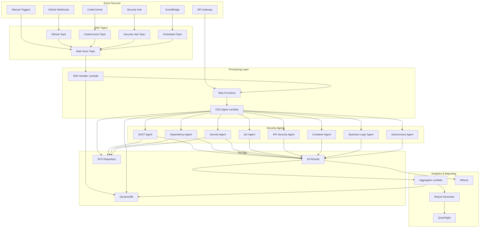

## Core Architecture

### Component Breakdown

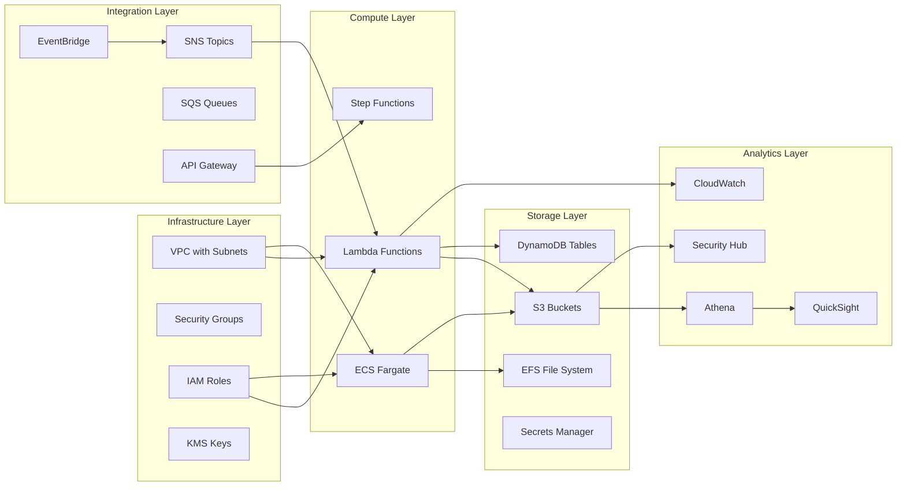

## SNS Event Flow

### Detailed SNS Message Processing

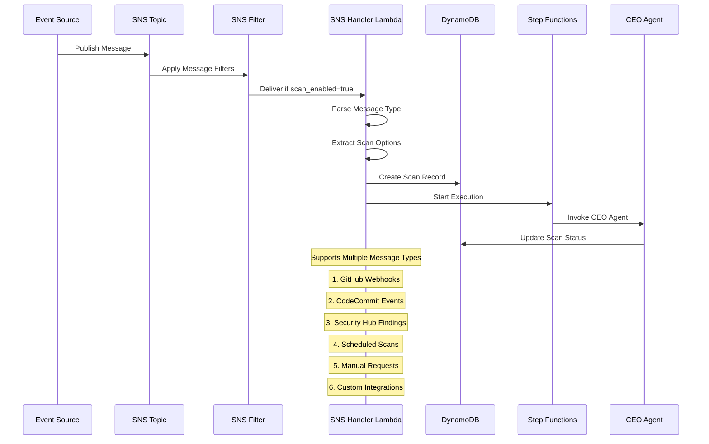

### SNS Topic Hierarchy

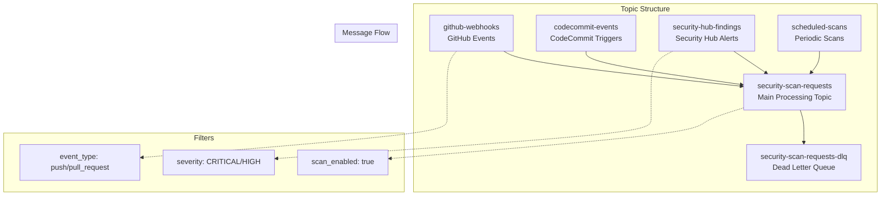

## Security Agent Architecture

### Agent Execution Flow

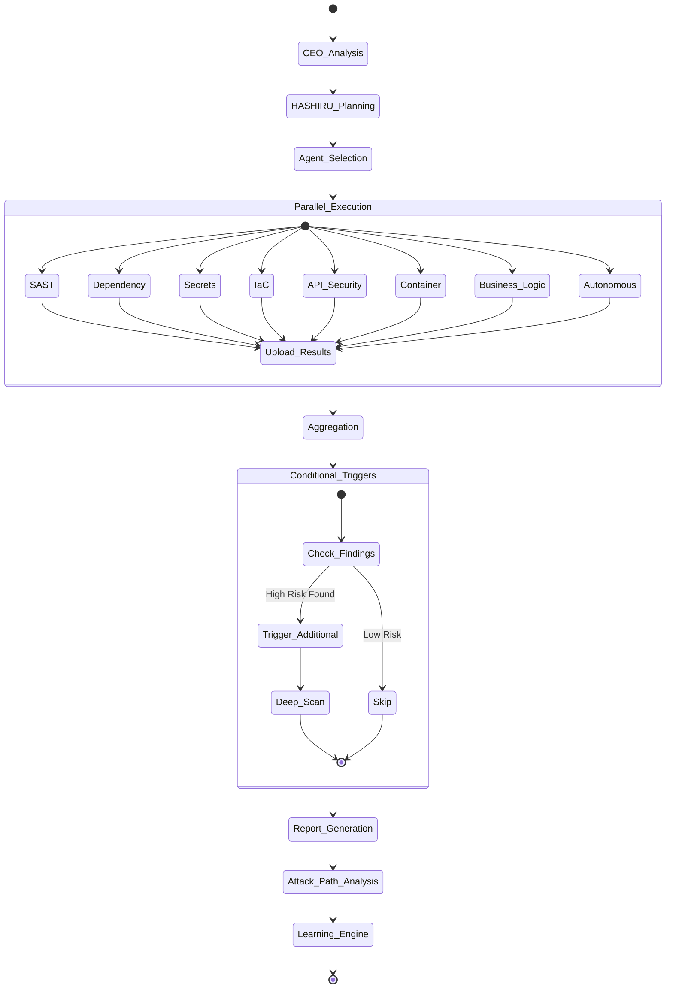

### Individual Agent Architecture

```mermaid
graph TB
    subgraph "SAST Agent (Semgrep)"
        S1[Pull Repository]
        S2[Load Rule Sets]
        S3[Run Semgrep Scan]
        S4[Parse Results]
        S5[Apply Severity Mapping]
        S6[Generate Findings]
    end
    
    subgraph "Dependency Agent (OWASP)"
        D1[Analyze Package Files]
        D2[Check CVE Database]
        D3[Identify Vulnerabilities]
        D4[Calculate Risk Score]
        D5[Generate Findings]
    end
    
    subgraph "Secrets Agent (TruffleHog)"
        SE1[Scan Repository]
        SE2[Pattern Matching]
        SE3[Entropy Analysis]
        SE4[Verify Live Secrets]
        SE5[Trigger Remediation]
    end
    
    subgraph "Container Agent"
        C1[Parse Dockerfiles]
        C2[Analyze K8s Manifests]
        C3[Check Security Policies]
        C4[Trivy Integration]
        C5[Generate Findings]
    end
    
    S1 --> S2 --> S3 --> S4 --> S5 --> S6
    D1 --> D2 --> D3 --> D4 --> D5
    SE1 --> SE2 --> SE3 --> SE4 --> SE5
    C1 --> C2 --> C3 --> C4 --> C5
```

## Data Flow & Storage

### Data Pipeline

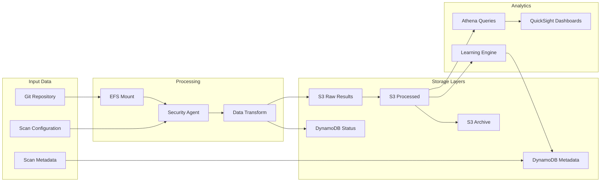

### Storage Lifecycle

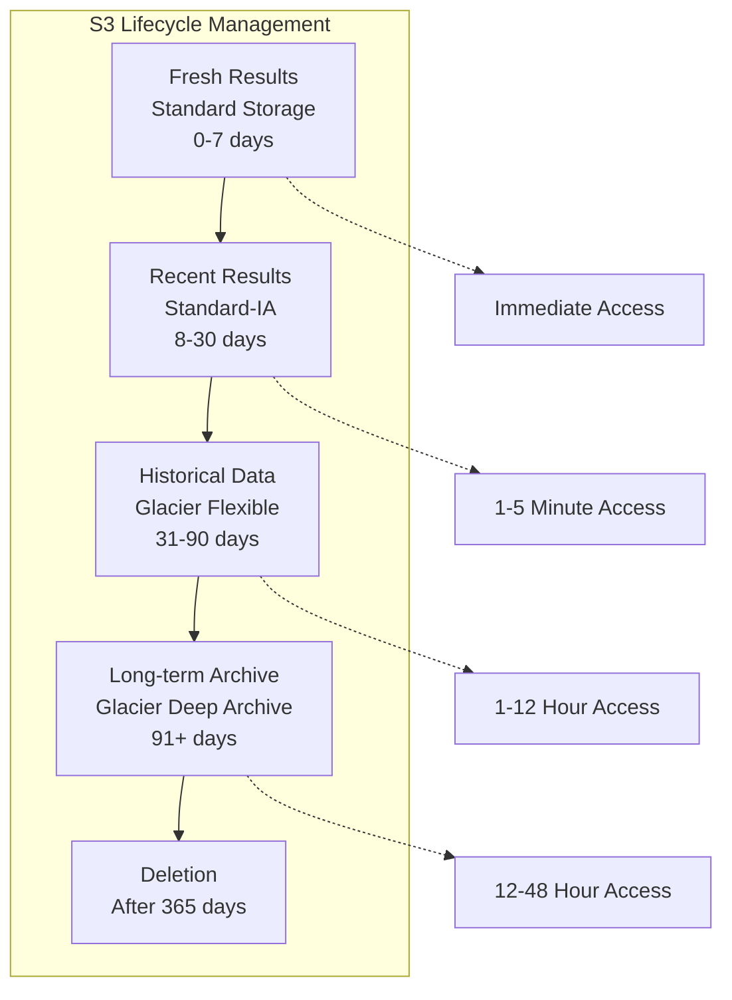

## HASHIRU Intelligence System

### Decision Flow

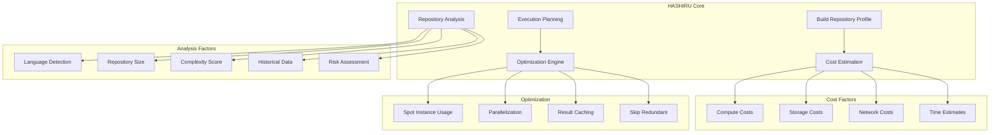

### Cost Optimization Engine

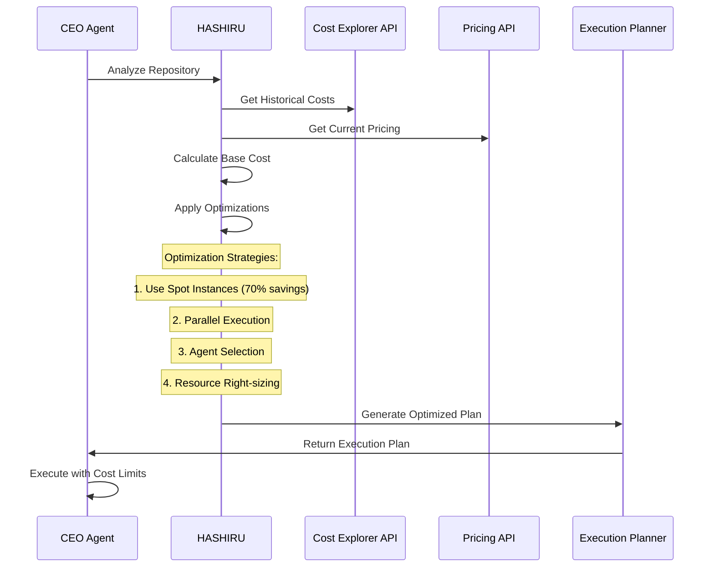

## Strands Communication Protocol

### Message Flow

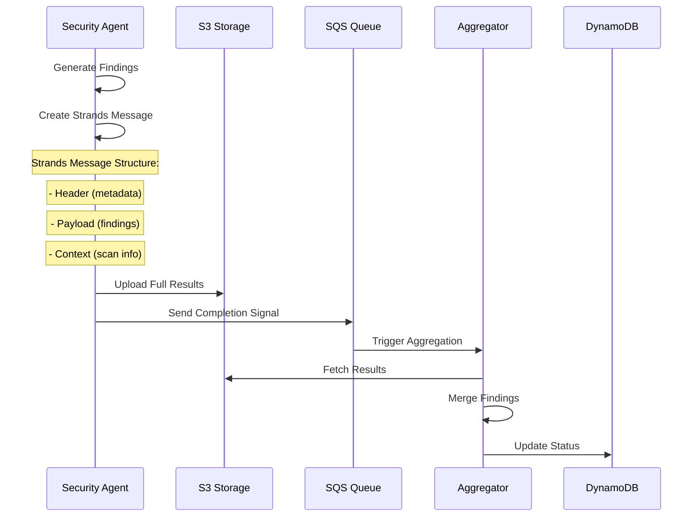

### Protocol Schema

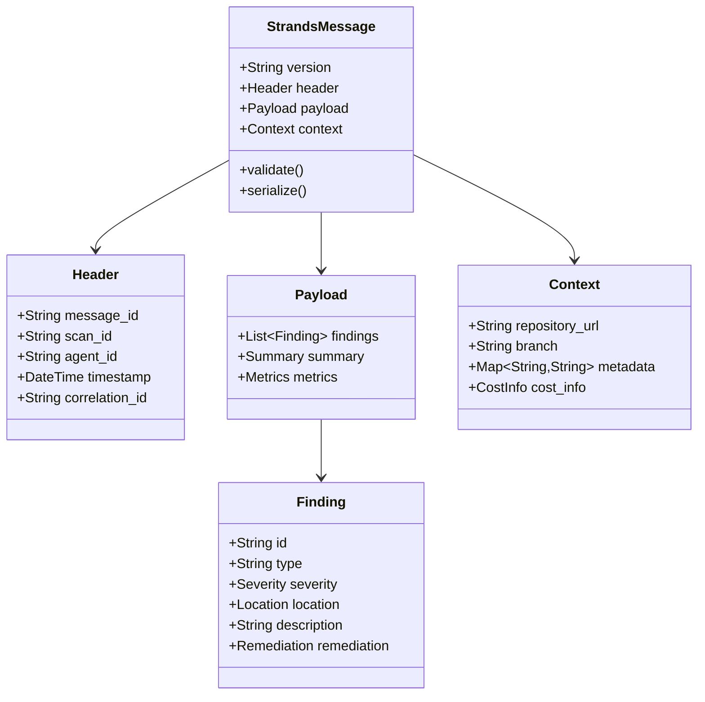

## Cost Optimization

### Cost Breakdown

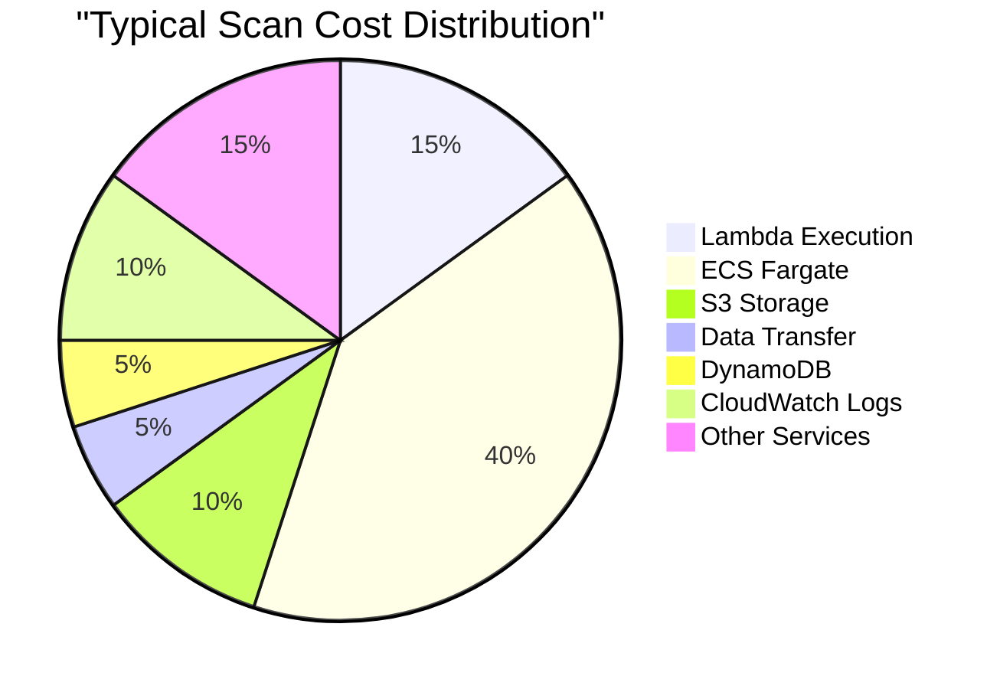

### Optimization Strategies

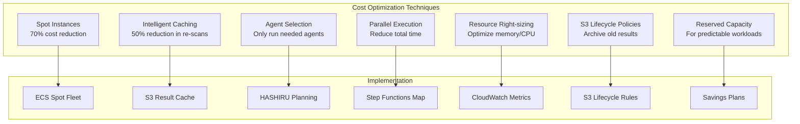

## Security & Compliance

### Security Architecture

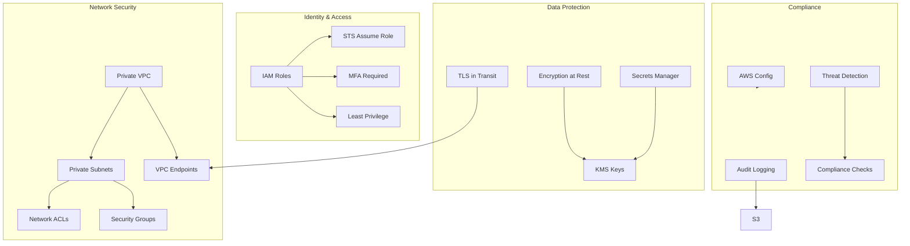

### Data Encryption Flow

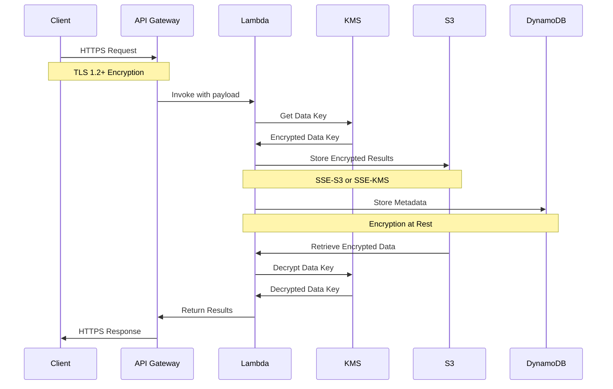

## Monitoring & Observability

### Monitoring Architecture

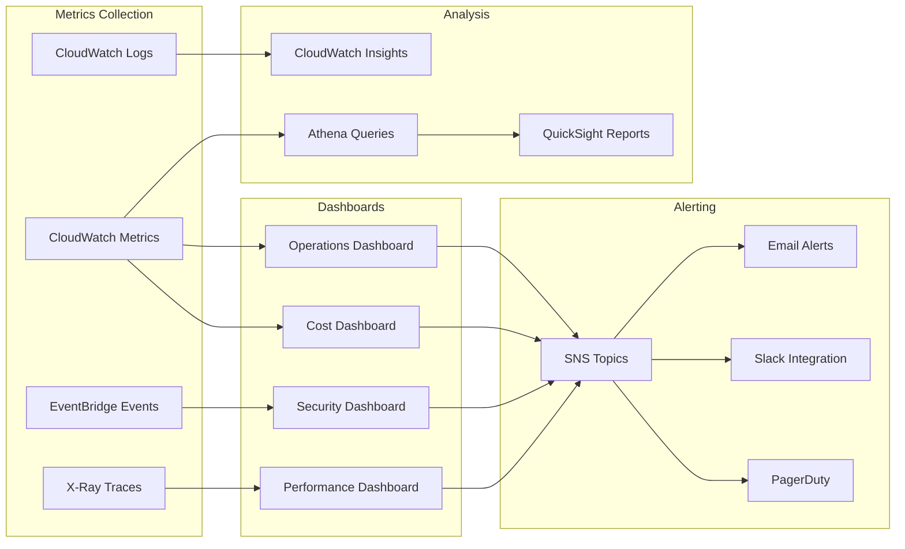

### Key Metrics

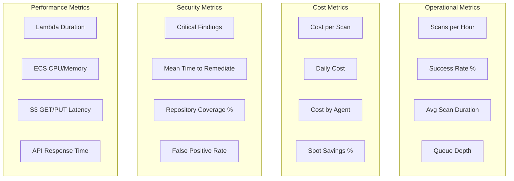

## Deployment Architecture

### Multi-Region Deployment

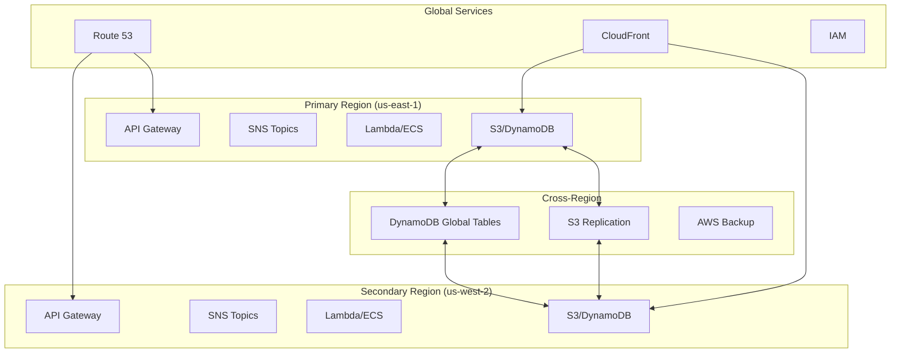

## Troubleshooting Guide

### Common Issues Flow

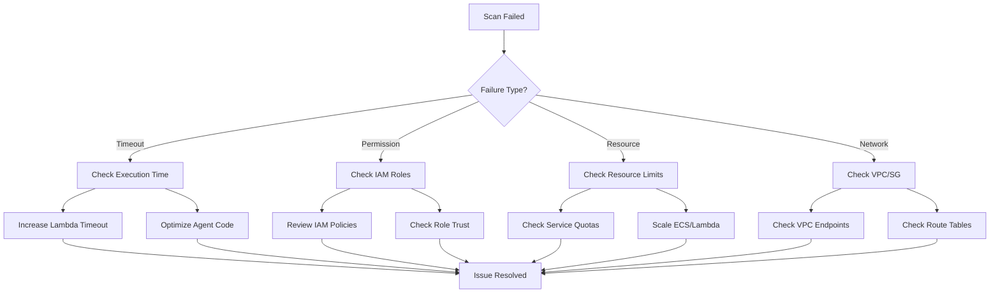

## Conclusion

This Security Audit Framework provides a comprehensive, scalable, and cost-effective solution for automated security scanning of Git repositories. The event-driven architecture with SNS at its core enables flexible integration with various CI/CD pipelines and security tools while maintaining high performance and reliability.

Key architectural decisions:
- **Event-driven design** for scalability and decoupling
- **Multi-agent architecture** for specialized security scanning
- **Cost optimization** through intelligent resource management
- **Security-first approach** with defense in depth
- **Observable system** with comprehensive monitoring

The framework is designed to grow with your security needs while maintaining operational excellence.