# Security Audit Framework - Operations Guide

## Table of Contents
1. [Deployment Guide](#deployment-guide)
2. [Configuration Management](#configuration-management)
3. [Monitoring & Alerting](#monitoring--alerting)
4. [Performance Tuning](#performance-tuning)
5. [Disaster Recovery](#disaster-recovery)
6. [Maintenance Procedures](#maintenance-procedures)
7. [Security Operations](#security-operations)
8. [Cost Management](#cost-management)
9. [Troubleshooting Runbook](#troubleshooting-runbook)
10. [Scaling Guide](#scaling-guide)

## Deployment Guide

### Prerequisites Checklist

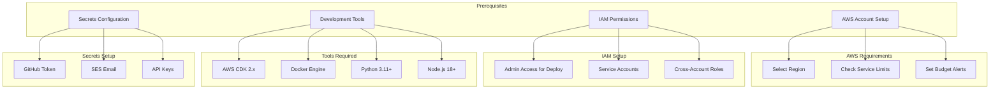

### Deployment Process

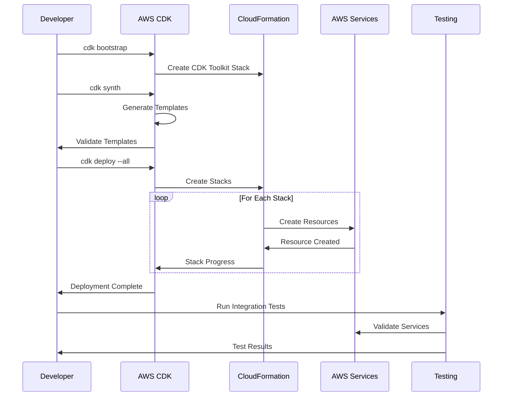

### Step-by-Step Deployment

1. **Environment Setup**
   ```bash
   # Clone repository
   git clone <repository-url>
   cd security-audit-framework
   
   # Install dependencies
   npm install -g aws-cdk
   pip install -r requirements.txt
   ```

2. **Configure AWS Credentials**
   ```bash
   # Configure AWS CLI
   aws configure
   
   # Set environment variables
   export AWS_REGION=us-east-1
   export CDK_DEFAULT_ACCOUNT=$(aws sts get-caller-identity --query Account --output text)
   export CDK_DEFAULT_REGION=$AWS_REGION
   ```

3. **Bootstrap CDK**
   ```bash
   # Bootstrap CDK in target region
   cdk bootstrap aws://$CDK_DEFAULT_ACCOUNT/$CDK_DEFAULT_REGION
   ```

4. **Deploy Infrastructure**
   ```bash
   # Deploy all stacks
   cd scripts
   ./deploy.sh
   
   # Or deploy individual stacks
   cdk deploy SecurityAudit-prod-Network
   cdk deploy SecurityAudit-prod-Storage
   # ... continue with other stacks
   ```

### Post-Deployment Verification

```mermaid
graph LR
    subgraph "Verification Steps"
        API[Test API Endpoints]
        SNS[Verify SNS Topics]
        Lambda[Check Lambda Functions]
        ECS[Validate ECS Tasks]
        Storage[Confirm S3/DynamoDB]
    end
    
    subgraph "Health Checks"
        API --> Health[/health endpoint]
        Lambda --> Logs[CloudWatch Logs]
        ECS --> Running[Task Status]
        Storage --> Access[Read/Write Test]
    end
    
    subgraph "Integration Tests"
        SNS --> Publish[Test Message]
        Publish --> Process[Verify Processing]
        Process --> Results[Check Results]
    end
```

## Configuration Management

### Environment Variables

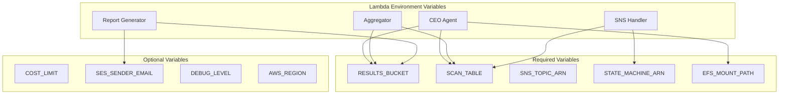

### Secrets Management

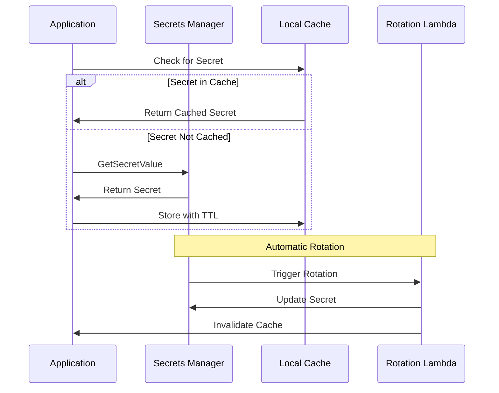

### Configuration Files

1. **CDK Configuration** (`cdk.json`)
   ```json
   {
     "app": "python3 app.py",
     "context": {
       "@aws-cdk/core:stackRelativeExports": true,
       "env": "prod",
       "cost_limit": 1000,
       "enable_spot": true,
       "retention_days": 90
     }
   }
   ```

2. **Agent Configuration** (`agent-config.json`)
   ```json
   {
     "agents": {
       "SAST": {
         "enabled": true,
         "memory": 2048,
         "timeout": 900,
         "rules": ["security", "owasp-top-10"]
       },
       "SECRETS": {
         "enabled": true,
         "memory": 1024,
         "timeout": 600,
         "entropy_threshold": 4.5
       }
     }
   }
   ```

## Monitoring & Alerting

### Dashboard Architecture

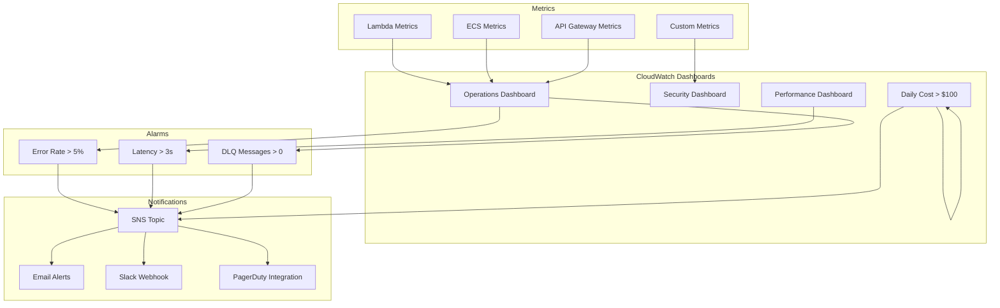

### Key Metrics to Monitor

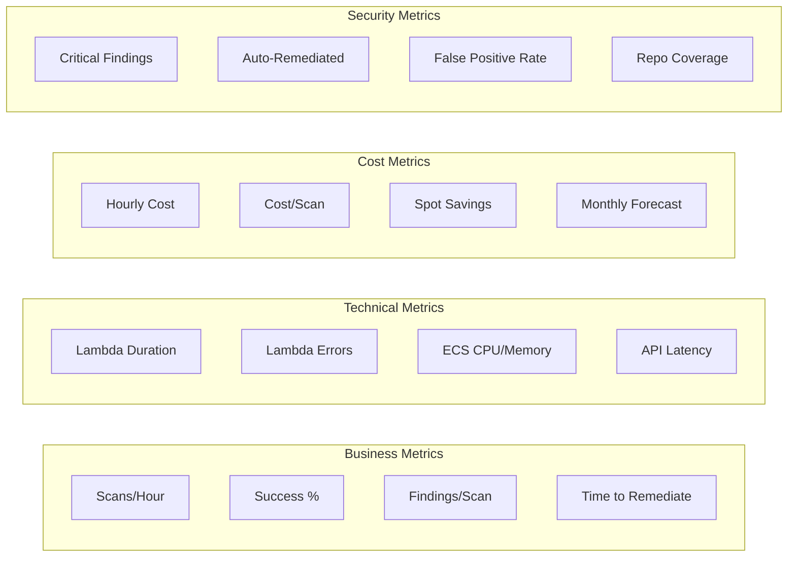

### CloudWatch Insights Queries

```sql
-- Top errors by Lambda function
fields @timestamp, @message
| filter @type = "REPORT"
| stats count(*) by functionName
| sort count desc

-- Average scan duration by repository
fields repository_url, duration
| filter @message like /Scan completed/
| stats avg(duration) by repository_url
| sort avg desc

-- Cost analysis by agent
fields agent_type, cost
| filter @message like /Agent execution cost/
| stats sum(cost) by agent_type
| sort sum desc

-- Failed scans root cause
fields @timestamp, error_message, repository_url
| filter status = "FAILED"
| stats count(*) by error_message
| sort count desc
```

## Performance Tuning

### Lambda Optimization

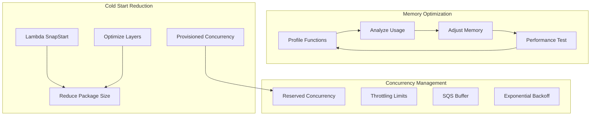

### ECS Task Optimization

```yaml
# Optimized task definition
taskDefinition:
  family: security-agent
  cpu: 1024  # 1 vCPU
  memory: 2048  # 2 GB
  
  containerDefinitions:
    - name: agent
      image: security-agent:latest
      
      # Resource limits
      cpu: 896  # Leave headroom for sidecar
      memory: 1792
      memoryReservation: 1024
      
      # Health check
      healthCheck:
        command: ["CMD-SHELL", "health-check.sh"]
        interval: 30
        timeout: 5
        retries: 3
        
      # Logging
      logConfiguration:
        logDriver: awslogs
        options:
          awslogs-group: /ecs/security-agent
          awslogs-stream-prefix: agent
          awslogs-multiline-pattern: "^\\d{4}-\\d{2}-\\d{2}"
```

## Disaster Recovery

### Backup Strategy

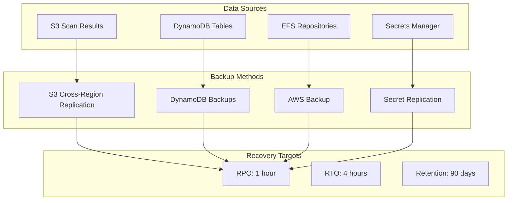

### Disaster Recovery Procedures

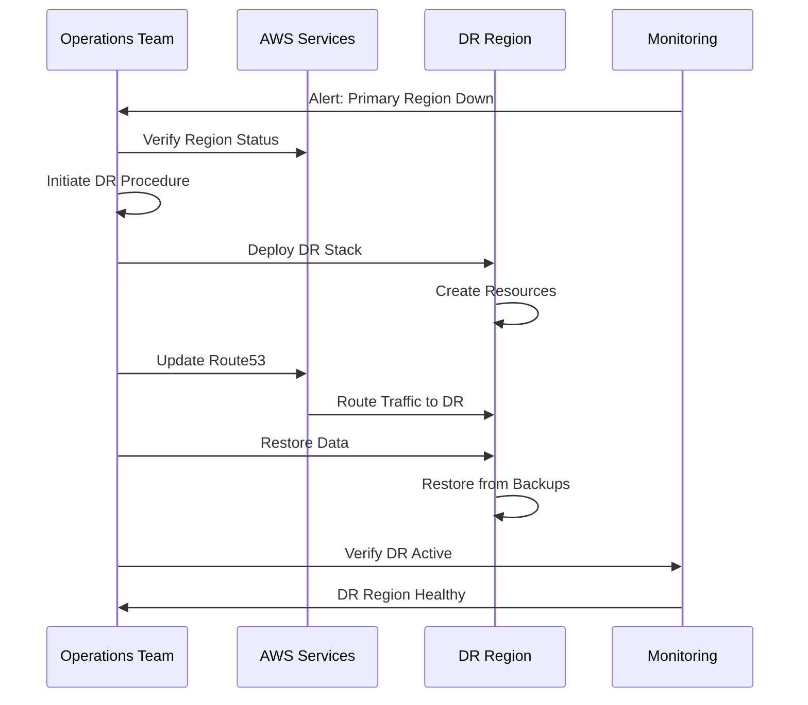

### Recovery Steps

1. **Detect Failure**
   ```bash
   # Check region health
   aws health describe-events --region us-east-1
   
   # Verify service status
   ./scripts/health-check.sh
   ```

2. **Activate DR Region**
   ```bash
   # Deploy to DR region
   export AWS_REGION=us-west-2
   cdk deploy --all --context env=dr
   ```

3. **Restore Data**
   ```bash
   # Restore DynamoDB
   aws dynamodb restore-table-from-backup \
     --target-table-name security-scans \
     --backup-arn $BACKUP_ARN
   
   # Verify S3 replication
   aws s3 sync s3://prod-results s3://dr-results --dryrun
   ```

4. **Update DNS**
   ```bash
   # Update Route53 records
   aws route53 change-resource-record-sets \
     --hosted-zone-id $ZONE_ID \
     --change-batch file://dr-dns-update.json
   ```

## Maintenance Procedures

### Regular Maintenance Tasks

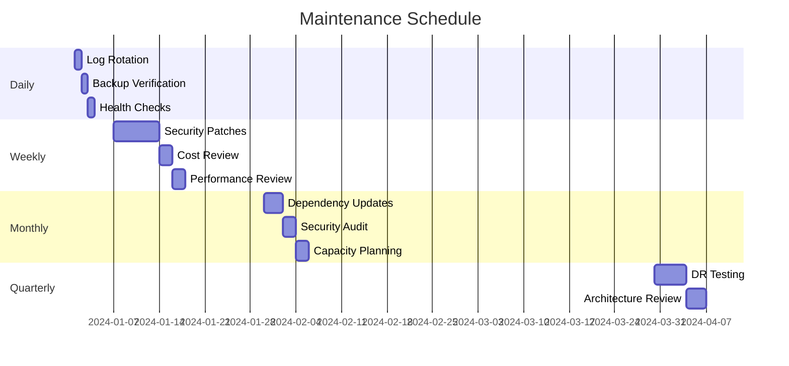

### Update Procedures

1. **Lambda Function Updates**
   ```bash
   # Update function code
   cd src/lambdas/ceo_agent
   zip -r function.zip .
   
   aws lambda update-function-code \
     --function-name SecurityAudit-CEO-Agent \
     --zip-file fileb://function.zip
   
   # Update function configuration
   aws lambda update-function-configuration \
     --function-name SecurityAudit-CEO-Agent \
     --memory-size 1024 \
     --timeout 300
   ```

2. **Container Updates**
   ```bash
   # Build and push new image
   docker build -t security-agent:latest .
   docker tag security-agent:latest $ECR_URI:latest
   docker push $ECR_URI:latest
   
   # Update ECS service
   aws ecs update-service \
     --cluster security-audit \
     --service sast-agent \
     --force-new-deployment
   ```

## Security Operations

### Security Monitoring

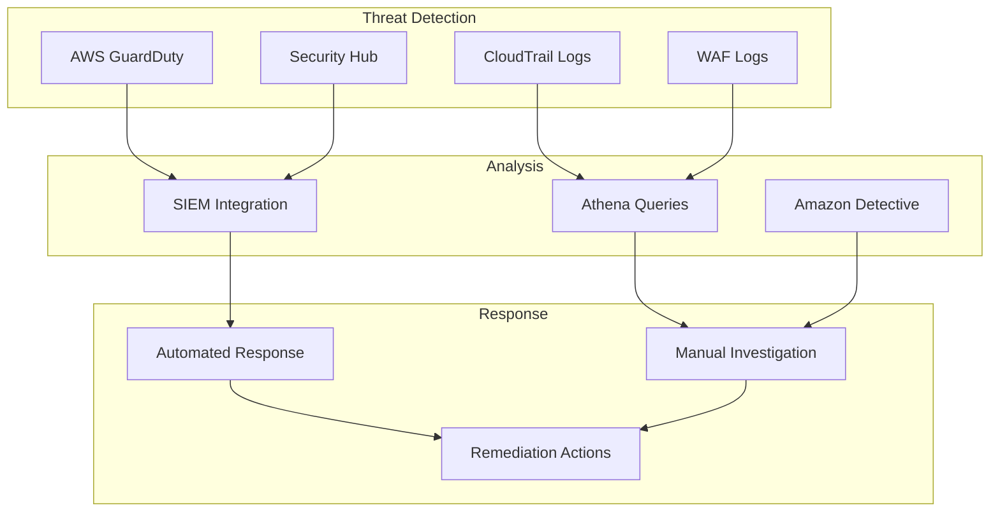

### Incident Response Playbook

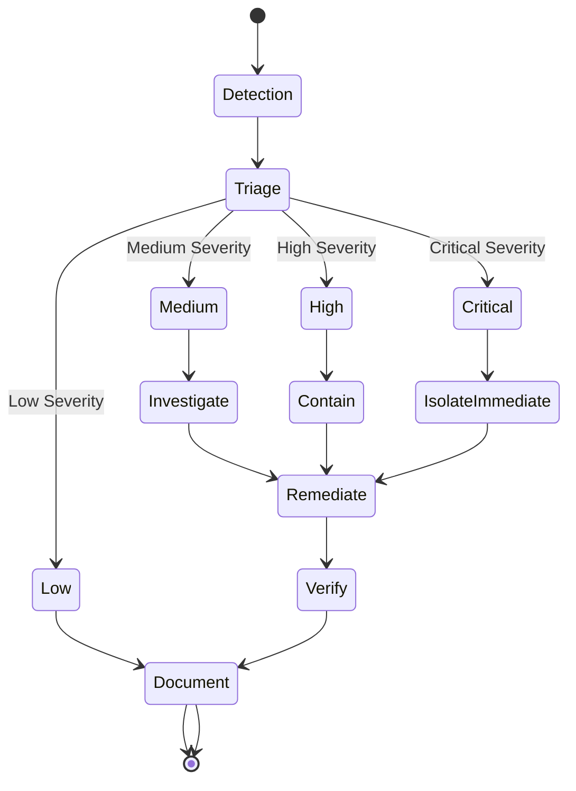

## Cost Management

### Cost Optimization Workflow

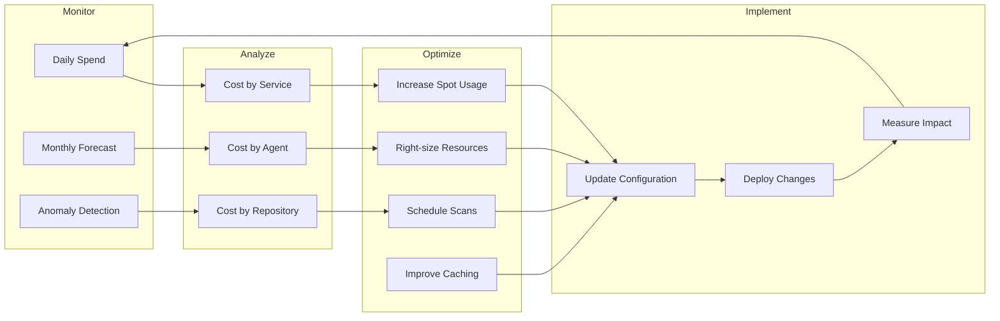

### Cost Reduction Strategies

1. **Spot Instance Optimization**
   ```yaml
   # ECS capacity provider
   capacityProvider:
     name: spot-capacity
     targetCapacity: 80  # 80% spot
     minimumScalingStepSize: 1
     maximumScalingStepSize: 10
   ```

2. **S3 Lifecycle Optimization**
   ```json
   {
     "Rules": [{
       "Id": "ArchiveOldScans",
       "Status": "Enabled",
       "Transitions": [
         {
           "Days": 30,
           "StorageClass": "STANDARD_IA"
         },
         {
           "Days": 90,
           "StorageClass": "GLACIER"
         }
       ]
     }]
   }
   ```

## Troubleshooting Runbook

### Common Issues and Solutions

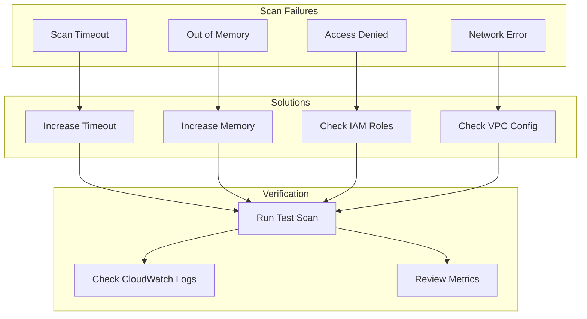

### Debug Commands

```bash
# Check Lambda logs
aws logs tail /aws/lambda/SecurityAudit-CEO-Agent --follow

# Check ECS task status
aws ecs describe-tasks \
  --cluster security-audit \
  --tasks $TASK_ARN

# Check Step Functions execution
aws stepfunctions describe-execution \
  --execution-arn $EXECUTION_ARN

# Check DynamoDB scan status
aws dynamodb get-item \
  --table-name security-scans \
  --key '{"scan_id": {"S": "scan-123"}}'

# Check S3 results
aws s3 ls s3://security-scan-results/scans/scan-123/ --recursive
```

## Scaling Guide

### Horizontal Scaling

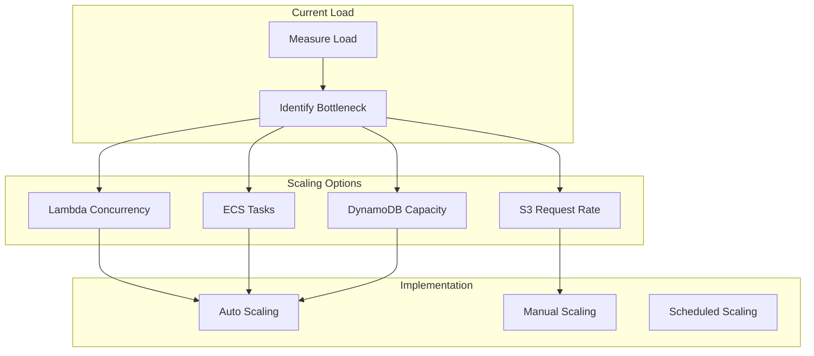

### Scaling Configuration

1. **Lambda Auto Scaling**
   ```json
   {
     "FunctionName": "SecurityAudit-CEO-Agent",
     "ProvisionedConcurrencyConfig": {
       "AllocatedConcurrentExecutions": 100
     },
     "ScalingConfig": {
       "MinimumConcurrency": 10,
       "MaximumConcurrency": 1000,
       "TargetValue": 0.7,
       "ScaleInCooldown": 60,
       "ScaleOutCooldown": 30
     }
   }
   ```

2. **ECS Service Auto Scaling**
   ```yaml
   autoScaling:
     minCapacity: 2
     maxCapacity: 50
     targetCPU: 70
     targetMemory: 80
     scaleInCooldown: 300
     scaleOutCooldown: 60
   ```

### Performance Benchmarks

| Component | Baseline | Optimized | Max Scale |
|-----------|----------|-----------|-----------|
| Scans/Hour | 100 | 500 | 2000 |
| Lambda Concurrent | 50 | 200 | 1000 |
| ECS Tasks | 10 | 50 | 200 |
| S3 Requests/Sec | 100 | 500 | 3500 |
| DynamoDB RCU | 100 | 500 | 40000 |
| DynamoDB WCU | 100 | 500 | 40000 |

## Conclusion

This operations guide provides comprehensive procedures for deploying, monitoring, maintaining, and scaling the Security Audit Framework. Follow these practices to ensure reliable, secure, and cost-effective operations.

Regular review and updates of these procedures ensure the system remains aligned with best practices and organizational requirements.