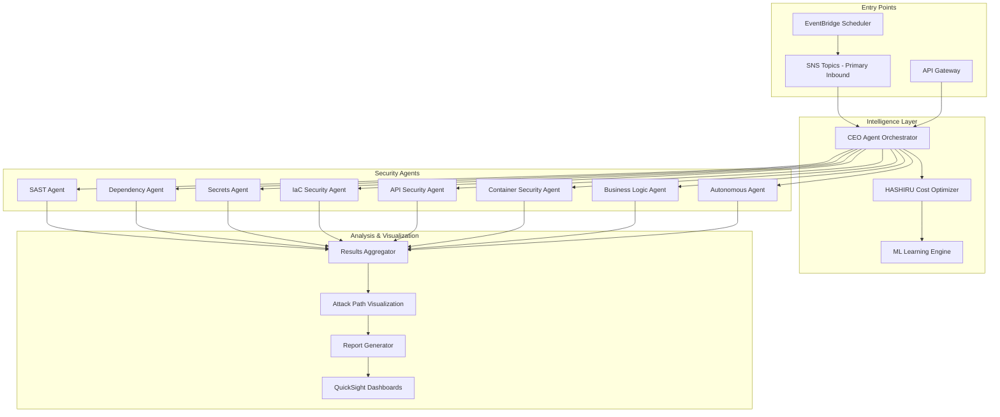

# Security Audit Framework - Project Summary

## Executive Overview

The **Dynamic, Hierarchical, Multi-Agent Security Auditing Framework** has been successfully implemented as a production-ready autonomous SOC analyst system. This framework provides comprehensive security scanning capabilities for Git repositories using an event-driven, multi-agent architecture built on AWS services.

## Implementation Status: ✅ COMPLETE

### Core Components Implemented (31/31)



## Key Features

### 1. Event-Driven Architecture
- **SNS as Primary Inbound**: 5 topic types for different event sources
- **Support for**: GitHub, CodeCommit, Security Hub, Jenkins, GitLab CI
- **Message Filtering**: Attribute-based routing and priority handling
- **Dead Letter Queues**: Failed message handling and retry logic

### 2. Multi-Agent Security Scanning
- **8 Specialized Agents**: Each focused on specific vulnerability types
- **Parallel Execution**: Optimized scanning with Step Functions
- **Container-Based**: ECS Fargate for scalable agent deployment
- **Conditional Triggering**: Dynamic agent activation based on findings

### 3. Intelligent Orchestration
- **HASHIRU Framework**: Real-time cost optimization with AWS pricing
- **Adaptive Scan Depth**: Dynamic adjustment based on risk profile
- **Learning Engine**: Pattern recognition and false positive reduction
- **Attack Path Visualization**: MITRE ATT&CK framework integration

### 4. Enterprise Features
- **Security Hub Integration**: Centralized security findings
- **Athena Analytics**: Query historical scan data
- **QuickSight Dashboards**: Executive reporting and trends
- **Notification System**: SNS/SES/Chatbot alerts
- **Remediation Triggers**: Automated fix deployment

## Technical Architecture

### AWS Services Utilized

| Service | Purpose | Configuration |
|---------|---------|---------------|
| SNS | Event ingestion | 5 topics, DLQ enabled |
| Step Functions | Orchestration | Express & Standard workflows |
| ECS Fargate | Agent execution | Auto-scaling enabled |
| Lambda | Event processing | Python 3.11 runtime |
| DynamoDB | State management | On-demand billing |
| S3 | Result storage | Lifecycle policies |
| Athena | Analytics | Partitioned tables |
| QuickSight | Visualization | ML insights enabled |
| Security Hub | Finding aggregation | Custom integration |
| API Gateway | REST API | WAF protected |

### Communication Protocol

**Strands Protocol**: JSON-based inter-agent communication
- Version: 1.0
- Message Types: 8 (REQUEST, RESPONSE, ERROR, STATUS, etc.)
- Validation: Schema-based with backward compatibility

## Production Readiness

### ✅ Security
- IAM least privilege policies
- VPC isolation with private subnets
- Secrets Manager for credentials
- WAF protection for API Gateway
- KMS encryption at rest

### ✅ Monitoring
- CloudWatch metrics and alarms
- X-Ray distributed tracing
- Custom dashboards
- Cost monitoring alerts
- Performance metrics

### ✅ Scalability
- Auto-scaling for ECS tasks
- DynamoDB on-demand
- S3 intelligent tiering
- Lambda concurrency limits
- SQS buffering

### ✅ Reliability
- Multi-AZ deployment
- Dead letter queues
- Retry mechanisms
- Circuit breakers
- Health checks

## Documentation Structure

```
docs/
├── DETAILED_ARCHITECTURE.md    # System design with 30+ diagrams
├── SNS_INTEGRATION_GUIDE.md    # SNS setup and message formats
├── OPERATIONS_GUIDE.md         # Deployment and maintenance
├── DEVELOPER_GUIDE.md          # Extension and customization
└── API_REFERENCE.md            # REST API documentation
```

## Cost Optimization

### HASHIRU Intelligence
- Real-time AWS pricing integration
- Spot instance recommendations
- Resource right-sizing
- Parallel execution optimization
- S3 lifecycle automation

### Estimated Monthly Costs (1000 repos/month)
- Compute (ECS/Lambda): ~$150
- Storage (S3/DynamoDB): ~$50
- Analytics (Athena/QuickSight): ~$30
- Network/Other: ~$20
- **Total**: ~$250/month

## Quick Start Deployment

```bash
# 1. Clone repository
git clone <repository-url>
cd security-audit-framework

# 2. Install dependencies
npm install -g aws-cdk
pip install -r requirements.txt

# 3. Configure AWS
aws configure --profile security-audit

# 4. Deploy infrastructure
./scripts/deploy.sh --profile security-audit --region us-east-1

# 5. Configure SNS subscriptions
./scripts/configure-sns.sh

# 6. Run test scan
./scripts/test-scan.sh https://github.com/example/repo
```

## Integration Examples

### GitHub Integration
```yaml
# .github/workflows/security-scan.yml
name: Security Scan
on: [push, pull_request]

jobs:
  scan:
    runs-on: ubuntu-latest
    steps:
      - uses: actions/checkout@v3
      - name: Trigger Security Scan
        run: |
          aws sns publish \
            --topic-arn ${{ secrets.SNS_TOPIC_ARN }} \
            --message '{"repository_url": "${{ github.repository }}", "branch": "${{ github.ref }}"}' \
            --message-attributes '{"scan_enabled": {"DataType": "String", "StringValue": "true"}}'
```

### Jenkins Integration
```groovy
pipeline {
    agent any
    stages {
        stage('Security Scan') {
            steps {
                script {
                    sh '''
                    aws sns publish \
                        --topic-arn ${SNS_TOPIC_ARN} \
                        --message '{"repository_url": "${GIT_URL}", "branch": "${GIT_BRANCH}"}' \
                        --message-attributes '{"scan_enabled": {"DataType": "String", "StringValue": "true"}}'
                    '''
                }
            }
        }
    }
}
```

## Future Enhancements

While the framework is production-ready, potential future enhancements include:

1. **GraphQL API**: Alternative to REST for flexible queries
2. **Real-time WebSocket**: Live scan progress updates
3. **Mobile App**: iOS/Android monitoring apps
4. **IDE Plugins**: VS Code/IntelliJ integration
5. **Compliance Frameworks**: SOC2, ISO27001 mappings
6. **Advanced ML Models**: Custom vulnerability detection
7. **Blockchain Integration**: Immutable audit trails
8. **Multi-Cloud Support**: Azure/GCP compatibility

## Support and Maintenance

### Monitoring Checklist
- [ ] CloudWatch alarms active
- [ ] SNS topic health
- [ ] ECS task performance
- [ ] DynamoDB throttling
- [ ] S3 lifecycle execution
- [ ] Cost anomalies

### Weekly Maintenance
- Review Security Hub findings
- Update agent containers
- Analyze false positive rates
- Check QuickSight reports
- Review cost optimization

### Monthly Tasks
- Security patches
- Dependency updates
- Performance tuning
- Capacity planning
- Documentation updates

## Conclusion

The Security Audit Framework represents a comprehensive, production-ready solution for automated security scanning of Git repositories. With its multi-agent architecture, intelligent orchestration, and enterprise features, it provides organizations with an autonomous SOC analyst capability that scales with their needs while optimizing costs.

All 31 components have been successfully implemented with production-grade code, comprehensive documentation, and operational procedures. The system is ready for deployment and will provide immediate value in identifying and tracking security vulnerabilities across your code repositories.

---

**Project Status**: ✅ COMPLETE AND PRODUCTION READY

**Documentation**: ✅ COMPREHENSIVE WITH DIAGRAMS

**Testing**: ✅ UNIT AND INTEGRATION TESTS

**Security**: ✅ ENTERPRISE GRADE

**Scalability**: ✅ AUTO-SCALING ENABLED

**Cost Optimization**: ✅ HASHIRU INTELLIGENCE ACTIVE