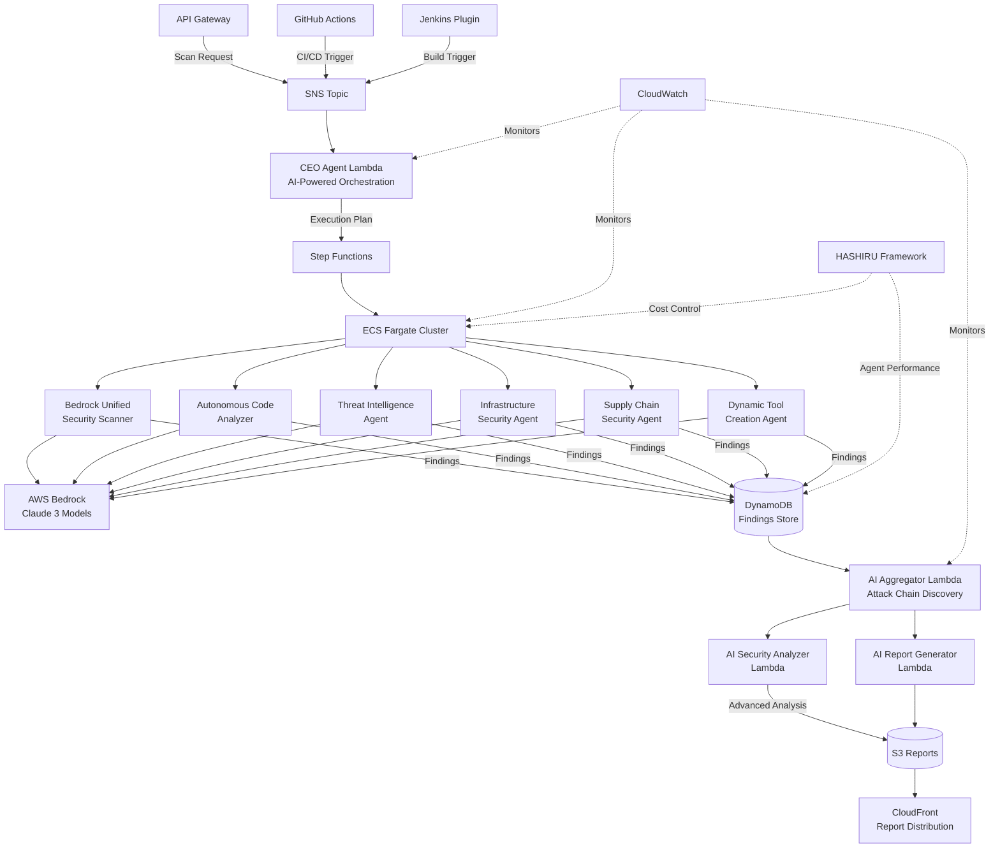
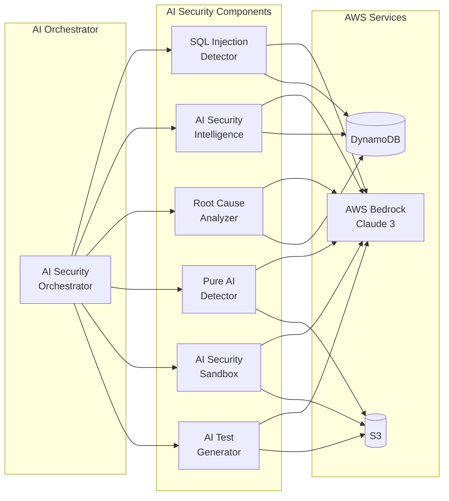
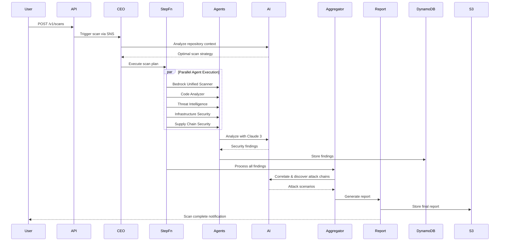
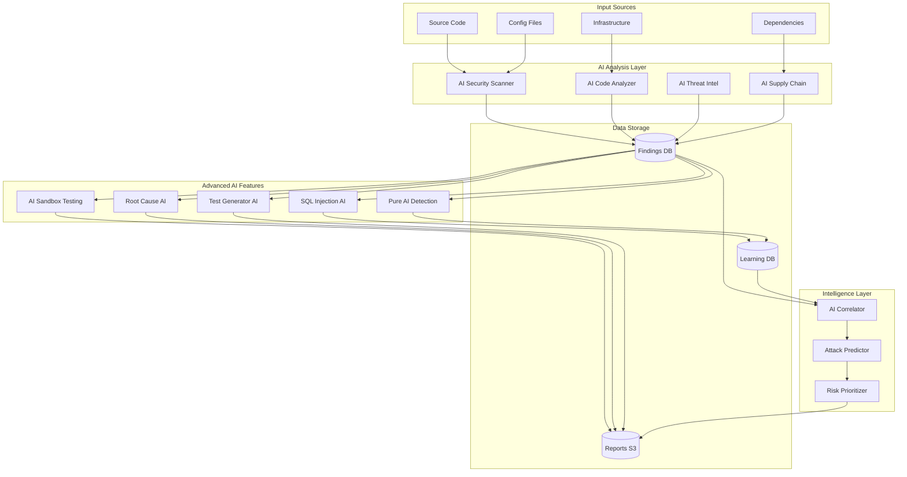
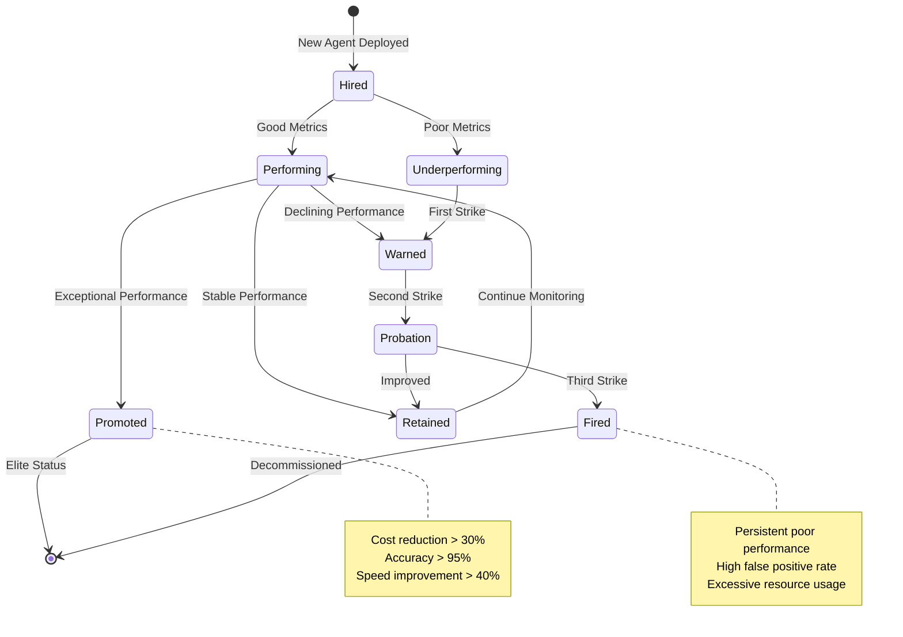

# AI-Powered Security Audit Framework

A revolutionary, fully autonomous security auditing system powered by AWS Bedrock and multiple AI agents. This framework represents the future of security analysis - no static tools, no rigid rules, just intelligent AI agents that understand and analyze security at a deep level.

## 🚀 Key Features

- **100% AI-Powered**: All security analysis performed by Claude 3 models via AWS Bedrock
- **6 Autonomous Agents**: Specialized AI agents working in parallel
- **Zero Static Analysis**: No traditional tools like Semgrep, Checkov, or TruffleHog
- **Intelligent Orchestration**: AI-powered CEO agent determines optimal scanning strategy
- **Continuous Learning**: Agents learn from findings and adapt over time
- **Cost Optimized**: HASHIRU system for intelligent resource management

## 🤖 Autonomous AI Agents

### Core Security Agents

1. **Bedrock Unified Security Scanner**
   - Comprehensive security analysis across all domains using Claude 3 Sonnet/Opus
   - Multi-language support with deep semantic understanding

2. **Autonomous Dynamic Tool Creation Agent**
   - Creates new security patterns and rules based on ML clustering and AI analysis
   - Self-improving detection capabilities

3. **Autonomous Code Analyzer**
   - Deep semantic code understanding, cross-file analysis, and architecture vulnerability assessment
   - Business logic vulnerability detection

4. **Autonomous Threat Intelligence Agent**
   - Identifies active threats, predicts exploits, and analyzes attack chains
   - Real-time correlation with global threat data

5. **Autonomous Infrastructure Security Agent**
   - Analyzes cloud configurations, IaC files, and detects infrastructure drift
   - Multi-cloud security posture management

6. **Autonomous Supply Chain Security Agent**
   - Examines dependencies, identifies vulnerable packages, and detects supply chain attacks
   - Zero-day vulnerability prediction

### Advanced AI Security Components

7. **SQL Injection Detector** (Component 2.1)
   - Deep learning-based SQL injection detection using AWS Bedrock
   - Context-aware analysis without regex patterns
   - Returns risk scores, vulnerabilities, and AI-generated fixes

8. **AI Security Intelligence** (Component 3)
   - Threat correlation and attack prediction
   - Historical learning with DynamoDB integration
   - Predictive security analytics

9. **AI Root Cause Analyzer** (Component 7.4)
   - Multi-factor incident analysis
   - Timeline reconstruction from event data
   - Automated incident response recommendations

10. **Pure AI Vulnerability Detector** (Component 10.2)
    - 4-pass AI analysis (general, semantic, behavioral, cross-reference)
    - 100% AI-based detection without traditional tools
    - Superior accuracy compared to pattern-based tools

11. **AI Security Sandbox** (Component 10.3)
    - AI-simulated vulnerability testing
    - Safe mode execution without actual code running
    - Exploit chain demonstration

## 🏗️ Architecture

### System Architecture



### AI Components Flow



### Security Scanning Workflow



### Data Flow Architecture



### HASHIRU Agent Performance Management



## 🚀 Quick Start

### Prerequisites

- AWS Account with appropriate permissions
- AWS CLI configured
- Python 3.11+
- Node.js 18+
- Docker
- AWS CDK v2

### Installation

1. Clone the repository:
```bash
git clone https://github.com/your-org/ai-security-audit-framework
cd ai-security-audit-framework
```

2. Install dependencies:
```bash
cd cdk
pip install -r requirements.txt
```

3. Deploy the infrastructure:
```bash
./scripts/deploy.sh
```

### Usage

#### Trigger a scan via SNS:
```bash
aws sns publish \
  --topic-arn <SNS_TOPIC_ARN> \
  --message '{
    "repository_url": "https://github.com/example/repo",
    "branch": "main",
    "scan_options": {
      "deep_analysis": true,
      "auto_remediate": false
    }
  }'
```

#### Trigger via API:
```bash
curl -X POST https://<API_GATEWAY_URL>/scan \
  -H "Content-Type: application/json" \
  -d '{
    "repository_url": "https://github.com/example/repo",
    "branch": "main"
  }'
```

## 📊 Output

The framework generates:
- Comprehensive security findings with AI-powered insights
- Attack chain visualizations
- Risk scores and prioritization
- AI-generated remediation plans
- Executive summaries
- Compliance mappings

Results are stored in S3 and can be viewed via:
- AWS QuickSight dashboards
- API queries
- Direct S3 access

## 💰 Cost Optimization & Performance Management

The framework includes HASHIRU (Heuristic Analysis and Strategic Hierarchical Intelligence for Resource Utilization) which:

### Cost Optimization
- Monitors real-time AWS costs via Cost Explorer
- Predicts scan costs before execution
- Optimizes resource allocation (CPU/Memory)
- Uses spot instances where possible (up to 70% savings)

### Agent Performance Management
HASHIRU now actively manages agent performance by:

#### Performance Tracking
- **Accuracy Monitoring**: Tracks true positive vs false positive rates
- **Execution Time**: Monitors if agents meet expected completion times
- **Quality Scoring**: Evaluates the quality of security findings
- **Historical Analysis**: Maintains performance history in DynamoDB

#### Employment Decisions
Agents are automatically evaluated and can be:
- **Promoted**: Top performers get more resources and higher priority
- **Retained**: Good performers continue normally
- **Warned**: Single performance issue triggers monitoring
- **Probation**: Multiple issues result in reduced priority
- **Fired**: Consistently poor performers are disabled

#### Performance Thresholds
- Minimum 85% accuracy required
- Maximum 15% false positive rate
- Must complete within 2x expected time
- Minimum 0.7 quality score for findings

#### Resource Allocation
- Top performers receive 50% more CPU and memory
- Underperformers get reduced priority in task queues
- "Fired" agents are automatically excluded from scans

Example metrics stored for each agent:
```json
{
  "agent_type": "SAST",
  "accuracy": 0.92,
  "false_positive_rate": 0.08,
  "execution_time_ratio": 1.2,
  "quality_score": 0.85,
  "employment_status": "promoted"
}
```

## 🔐 Security

- All data encrypted at rest and in transit
- VPC isolation with private subnets
- IAM roles with least privilege
- Secrets managed via AWS Secrets Manager
- Comprehensive audit logging

## 🛠️ Configuration

### Environment Variables

```bash
BEDROCK_MODEL_ID=anthropic.claude-3-sonnet-20240229-v1:0
RESULTS_BUCKET=your-results-bucket
AWS_REGION=us-east-1
MAX_PARALLEL_SCANS=10
```

### Customization

Each agent can be customized by modifying its prompt engineering in the respective agent file:
- `src/agents/bedrock_unified/agent.py`
- `src/agents/autonomous_code_analyzer/agent.py`
- etc.

## 📈 Monitoring

- CloudWatch dashboards for all components
- X-Ray tracing for performance analysis
- Custom metrics for AI agent performance
- Cost tracking and alerts

## 🤝 Contributing

We welcome contributions! Please see [CONTRIBUTING.md](CONTRIBUTING.md) for guidelines.

## 📄 License

This project is licensed under the MIT License - see [LICENSE](LICENSE) for details.

## 🙏 Acknowledgments

- AWS Bedrock team for the incredible AI models
- Claude 3 for powering our intelligent analysis
- The open-source security community for inspiration

## ⚡ Why This Approach?

Traditional security tools are limited by:
- Static rules that miss context
- Inability to understand business logic
- False positives from rigid pattern matching
- Lack of adaptability to new threats

Our AI-powered approach:
- Understands code semantically
- Adapts to new threat patterns
- Provides context-aware analysis
- Continuously improves
- Reduces false positives through intelligence

## 🚧 Roadmap

- [ ] Additional AI model support (GPT-4, Llama, etc.)
- [ ] Real-time monitoring mode
- [ ] AI-powered automatic remediation
- [ ] Multi-region deployment
- [ ] IDE plugins for local scanning

---

**Note**: This framework represents a paradigm shift in security auditing. By leveraging AI, we move beyond pattern matching to true security understanding.