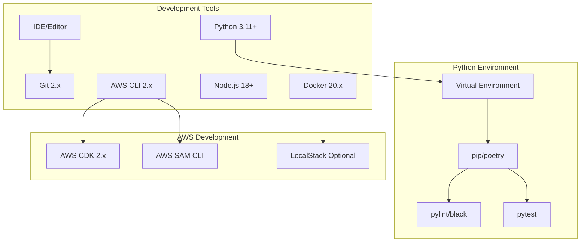
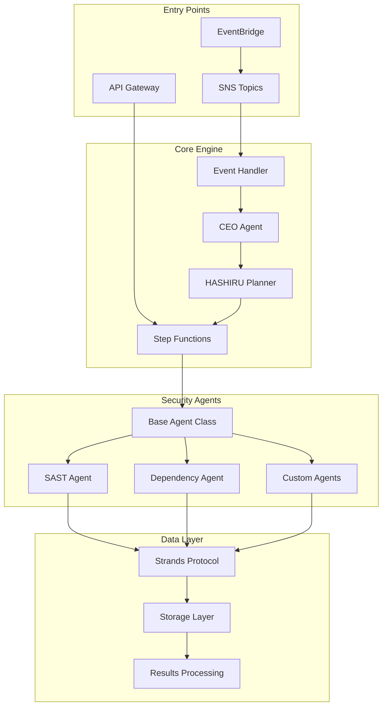
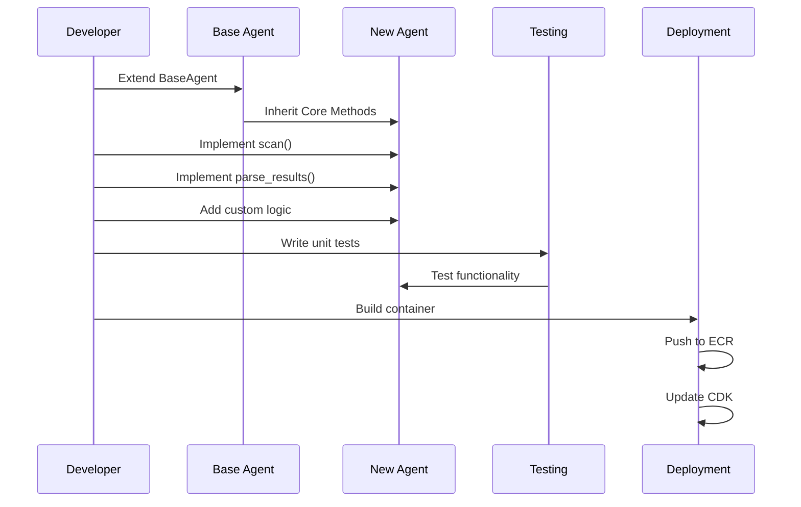
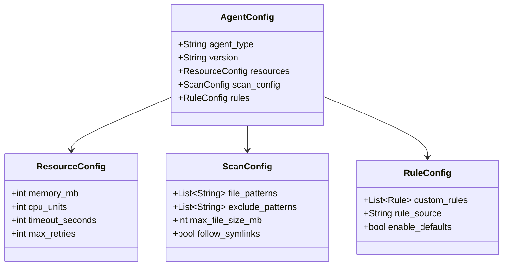
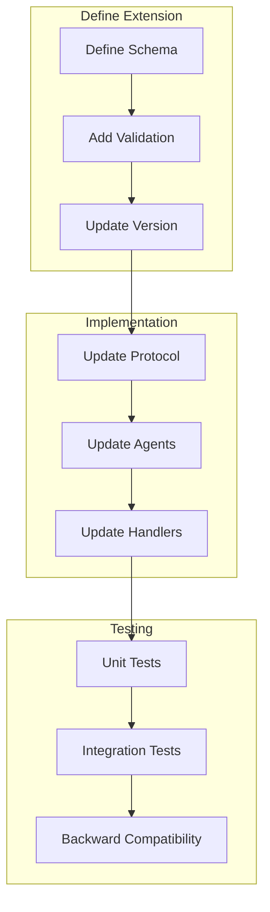
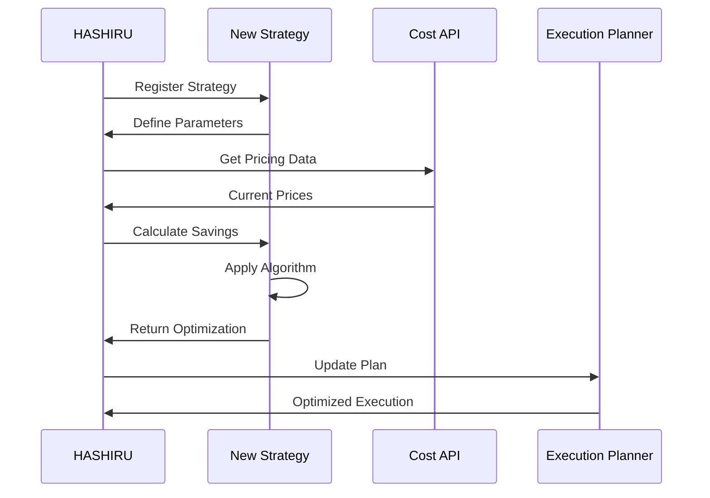
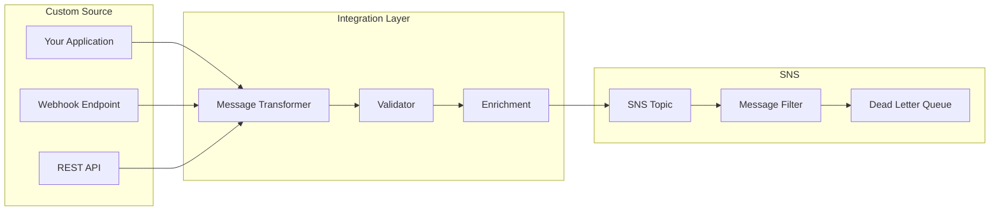
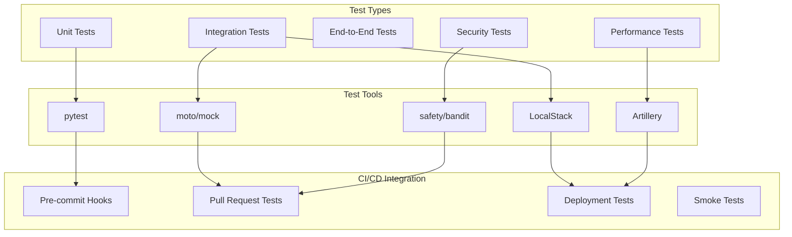
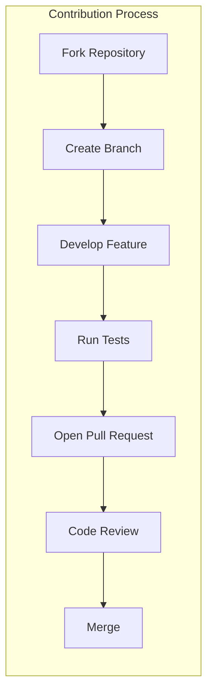

# Security Audit Framework - Developer Guide

## Table of Contents
1. [Development Environment Setup](#development-environment-setup)
2. [Framework Architecture Overview](#framework-architecture-overview)
3. [Adding New Security Agents](#adding-new-security-agents)
4. [Extending the Strands Protocol](#extending-the-strands-protocol)
5. [HASHIRU Intelligence Extensions](#hashiru-intelligence-extensions)
6. [Custom SNS Integrations](#custom-sns-integrations)
7. [Testing Strategy](#testing-strategy)
8. [API Development](#api-development)
9. [Performance Optimization](#performance-optimization)
10. [Contributing Guidelines](#contributing-guidelines)

## Development Environment Setup

### Prerequisites



### Initial Setup

```bash
# Clone repository
git clone <repository-url>
cd security-audit-framework

# Setup Python environment
python -m venv venv
source venv/bin/activate  # On Windows: venv\Scripts\activate
pip install -r requirements-dev.txt

# Install pre-commit hooks
pre-commit install

# Setup AWS CDK
npm install -g aws-cdk
cd cdk && npm install

# Configure AWS credentials
aws configure --profile dev-security-audit

# Setup LocalStack (optional)
docker-compose -f docker-compose.local.yml up -d
```

## Framework Architecture Overview

### Component Interaction



### Code Organization

```
security-audit-framework/
├── src/
│   ├── shared/              # Shared libraries
│   │   ├── strands.py      # Communication protocol
│   │   ├── hashiru.py      # Intelligence engine
│   │   └── utils.py        # Common utilities
│   │
│   ├── lambdas/            # Lambda functions
│   │   ├── ceo_agent/      # Orchestration
│   │   ├── aggregator/     # Results aggregation
│   │   └── sns_handler/    # SNS processing
│   │
│   └── agents/             # Security agents
│       ├── base/           # Base agent class
│       ├── sast/           # SAST implementation
│       └── custom/         # Custom agents
│
├── cdk/                    # Infrastructure as Code
│   ├── stacks/            # CDK stacks
│   └── app.py             # CDK application
│
├── tests/                  # Test suites
│   ├── unit/              # Unit tests
│   └── integration/       # Integration tests
│
└── docs/                   # Documentation
```

## Adding New Security Agents

### Agent Development Workflow



### Step-by-Step Agent Creation

1. **Create Agent Structure**
   ```python
   # src/agents/custom_agent/agent.py
   from typing import Dict, List, Any
   from shared.base_agent import BaseAgent
   from shared.strands import StrandsMessage, SecurityFinding
   
   class CustomSecurityAgent(BaseAgent):
       """Custom security agent for specific vulnerability detection"""
       
       def __init__(self):
           super().__init__(agent_type="CUSTOM")
           self.name = "Custom Security Agent"
           self.version = "1.0.0"
   ```

2. **Implement Core Methods**
   ```python
   def scan(self, repository_path: str, config: Dict[str, Any]) -> List[SecurityFinding]:
       """Execute security scan on repository"""
       findings = []
       
       # Implement your scanning logic
       for file_path in self.get_files(repository_path, patterns=["*.py", "*.js"]):
           vulnerabilities = self.analyze_file(file_path)
           findings.extend(vulnerabilities)
       
       return findings
   
   def analyze_file(self, file_path: str) -> List[SecurityFinding]:
       """Analyze individual file for vulnerabilities"""
       findings = []
       
       with open(file_path, 'r') as f:
           content = f.read()
           
       # Custom vulnerability detection logic
       if self.detect_vulnerability(content):
           finding = SecurityFinding(
               id=self.generate_finding_id(),
               type="CUSTOM_VULNERABILITY",
               severity="HIGH",
               title="Custom Security Issue Detected",
               description="Detailed description of the issue",
               file_path=file_path,
               line_number=self.get_line_number(content),
               remediation="How to fix this issue"
           )
           findings.append(finding)
       
       return findings
   ```

3. **Create Dockerfile**
   ```dockerfile
   # src/agents/custom_agent/Dockerfile
   FROM python:3.11-slim
   
   WORKDIR /app
   
   # Install dependencies
   COPY requirements.txt .
   RUN pip install --no-cache-dir -r requirements.txt
   
   # Copy agent code
   COPY . .
   
   # Set environment variables
   ENV PYTHONUNBUFFERED=1
   ENV AGENT_TYPE=CUSTOM
   
   # Run agent
   CMD ["python", "-m", "agent"]
   ```

4. **Add CDK Configuration**
   ```python
   # cdk/stacks/ecs_stack.py - Add to existing stack
   
   # Custom agent task definition
   self.custom_task_definition = ecs.FargateTaskDefinition(
       self, "CustomAgentTaskDef",
       memory_limit_mib=2048,
       cpu=1024,
       execution_role=task_execution_role,
       task_role=custom_task_role,
       family="custom-security-agent"
   )
   
   # Add container
   custom_container = self.custom_task_definition.add_container(
       "custom-agent",
       image=ecs.ContainerImage.from_asset(
           "../src/agents/custom_agent",
           platform=Platform.LINUX_AMD64
       ),
       environment={
           "RESULTS_BUCKET": results_bucket.bucket_name,
           "AGENT_TYPE": "CUSTOM"
       },
       logging=ecs.LogDrivers.aws_logs(
           stream_prefix="custom-agent",
           log_retention=logs.RetentionDays.ONE_WEEK
       )
   )
   ```

### Agent Configuration Schema



## Extending the Strands Protocol

### Message Extension Process



### Adding Custom Fields

```python
# shared/strands.py - Extending the protocol

from dataclasses import dataclass, field
from typing import Dict, Any, Optional

@dataclass
class ExtendedStrandsMessage(StrandsMessage):
    """Extended Strands message with custom fields"""
    
    # New fields
    scan_metadata: Dict[str, Any] = field(default_factory=dict)
    ml_insights: Optional[Dict[str, Any]] = None
    compliance_mapping: Optional[Dict[str, str]] = None
    
    def validate(self) -> bool:
        """Validate extended message"""
        # Call parent validation
        if not super().validate():
            return False
        
        # Custom validation
        if self.ml_insights:
            required_fields = ['confidence', 'model_version']
            if not all(field in self.ml_insights for field in required_fields):
                return False
        
        return True
    
    def to_dict(self) -> Dict[str, Any]:
        """Convert to dictionary with extended fields"""
        base_dict = super().to_dict()
        base_dict.update({
            'scan_metadata': self.scan_metadata,
            'ml_insights': self.ml_insights,
            'compliance_mapping': self.compliance_mapping
        })
        return base_dict
```

## HASHIRU Intelligence Extensions

### Adding Cost Optimization Strategies



### Custom Strategy Implementation

```python
# shared/hashiru/strategies/custom_strategy.py

from abc import ABC, abstractmethod
from typing import Dict, Any, List

class OptimizationStrategy(ABC):
    """Base class for optimization strategies"""
    
    @abstractmethod
    def optimize(self, plan: Dict[str, Any], constraints: Dict[str, Any]) -> Dict[str, Any]:
        """Apply optimization to execution plan"""
        pass
    
    @abstractmethod
    def estimate_savings(self, plan: Dict[str, Any]) -> float:
        """Estimate cost savings from optimization"""
        pass

class ParallelizationStrategy(OptimizationStrategy):
    """Optimize by maximizing parallel execution"""
    
    def optimize(self, plan: Dict[str, Any], constraints: Dict[str, Any]) -> Dict[str, Any]:
        # Analyze task dependencies
        tasks = plan.get('tasks', [])
        dependency_graph = self.build_dependency_graph(tasks)
        
        # Calculate optimal parallelization
        parallel_groups = self.calculate_parallel_groups(dependency_graph)
        
        # Update plan with parallel execution
        optimized_plan = plan.copy()
        optimized_plan['execution_mode'] = 'parallel'
        optimized_plan['parallel_groups'] = parallel_groups
        
        return optimized_plan
    
    def estimate_savings(self, plan: Dict[str, Any]) -> float:
        # Calculate time savings from parallelization
        sequential_time = sum(task.get('estimated_duration', 0) for task in plan.get('tasks', []))
        parallel_time = max(
            sum(task.get('estimated_duration', 0) for task in group)
            for group in plan.get('parallel_groups', [[]])
        )
        
        time_savings = sequential_time - parallel_time
        cost_per_second = 0.0001  # Example rate
        
        return time_savings * cost_per_second
```

## Custom SNS Integrations

### Integration Architecture



### Custom Integration Example

```python
# integrations/custom_integration.py

import json
import boto3
from typing import Dict, Any
from dataclasses import dataclass

@dataclass
class CustomIntegration:
    """Custom integration for external security tool"""
    
    sns_client: boto3.client
    topic_arn: str
    source_name: str
    
    def transform_webhook(self, webhook_data: Dict[str, Any]) -> Dict[str, Any]:
        """Transform webhook data to SNS message format"""
        
        # Extract relevant information
        repository_info = webhook_data.get('repository', {})
        scan_request = {
            'type': 'custom_integration',
            'repository_url': repository_info.get('url'),
            'branch': repository_info.get('default_branch', 'main'),
            'integration_name': self.source_name,
            'custom_data': {
                'tool_name': webhook_data.get('tool_name'),
                'scan_id': webhook_data.get('scan_id'),
                'triggered_by': webhook_data.get('user')
            },
            'scan_options': {
                'deep_scan': webhook_data.get('full_scan', False),
                'priority': self.determine_priority(webhook_data)
            }
        }
        
        return scan_request
    
    def publish_scan_request(self, scan_request: Dict[str, Any]) -> str:
        """Publish scan request to SNS"""
        
        # Validate request
        if not self.validate_request(scan_request):
            raise ValueError("Invalid scan request format")
        
        # Add message attributes
        message_attributes = {
            'scan_enabled': {
                'DataType': 'String',
                'StringValue': 'true'
            },
            'source': {
                'DataType': 'String',
                'StringValue': self.source_name
            },
            'priority': {
                'DataType': 'String',
                'StringValue': scan_request['scan_options'].get('priority', 'normal')
            }
        }
        
        # Publish to SNS
        response = self.sns_client.publish(
            TopicArn=self.topic_arn,
            Message=json.dumps(scan_request),
            MessageAttributes=message_attributes
        )
        
        return response['MessageId']
    
    def validate_request(self, request: Dict[str, Any]) -> bool:
        """Validate scan request format"""
        required_fields = ['type', 'repository_url']
        return all(field in request for field in required_fields)
    
    def determine_priority(self, webhook_data: Dict[str, Any]) -> str:
        """Determine scan priority based on webhook data"""
        if webhook_data.get('severity') == 'critical':
            return 'high'
        elif webhook_data.get('branch') == 'main':
            return 'normal'
        else:
            return 'low'
```

## Testing Strategy

### Test Architecture



### Writing Effective Tests

```python
# tests/unit/test_custom_agent.py

import pytest
from unittest.mock import Mock, patch
from agents.custom_agent.agent import CustomSecurityAgent
from shared.strands import SecurityFinding, FindingSeverity

class TestCustomAgent:
    """Test suite for custom security agent"""
    
    @pytest.fixture
    def agent(self):
        """Create agent instance"""
        return CustomSecurityAgent()
    
    @pytest.fixture
    def mock_repository(self, tmp_path):
        """Create mock repository structure"""
        repo_path = tmp_path / "test_repo"
        repo_path.mkdir()
        
        # Create test files
        (repo_path / "vulnerable.py").write_text("""
        # Vulnerable code
        eval(user_input)
        """)
        
        (repo_path / "safe.py").write_text("""
        # Safe code
        print("Hello, World!")
        """)
        
        return str(repo_path)
    
    def test_scan_detects_vulnerability(self, agent, mock_repository):
        """Test that agent detects known vulnerabilities"""
        # Run scan
        findings = agent.scan(mock_repository, {})
        
        # Verify findings
        assert len(findings) == 1
        assert findings[0].type == "CUSTOM_VULNERABILITY"
        assert findings[0].severity == FindingSeverity.HIGH
        assert "vulnerable.py" in findings[0].file_path
    
    def test_scan_ignores_safe_code(self, agent, mock_repository):
        """Test that agent doesn't flag safe code"""
        # Remove vulnerable file
        import os
        os.remove(os.path.join(mock_repository, "vulnerable.py"))
        
        # Run scan
        findings = agent.scan(mock_repository, {})
        
        # Verify no findings
        assert len(findings) == 0
    
    @patch('boto3.client')
    def test_results_upload(self, mock_boto, agent, mock_repository):
        """Test results upload to S3"""
        # Mock S3 client
        mock_s3 = Mock()
        mock_boto.return_value = mock_s3
        
        # Run scan and upload
        findings = agent.scan(mock_repository, {})
        agent.upload_results(findings, "test-scan-id")
        
        # Verify S3 upload called
        mock_s3.put_object.assert_called_once()
        call_args = mock_s3.put_object.call_args[1]
        assert call_args['Bucket'] == 'test-results-bucket'
        assert 'test-scan-id' in call_args['Key']
```

### Integration Testing

```python
# tests/integration/test_sns_integration.py

import pytest
import boto3
import json
from moto import mock_sns, mock_stepfunctions

@mock_sns
@mock_stepfunctions
class TestSNSIntegration:
    """Integration tests for SNS message flow"""
    
    def setup_method(self):
        """Setup test resources"""
        self.sns = boto3.client('sns', region_name='us-east-1')
        self.sfn = boto3.client('stepfunctions', region_name='us-east-1')
        
        # Create test topic
        response = self.sns.create_topic(Name='test-scan-requests')
        self.topic_arn = response['TopicArn']
    
    def test_message_triggers_scan(self):
        """Test that SNS message triggers security scan"""
        # Publish test message
        message = {
            'repository_url': 'https://github.com/test/repo.git',
            'branch': 'main',
            'type': 'manual_scan'
        }
        
        response = self.sns.publish(
            TopicArn=self.topic_arn,
            Message=json.dumps(message),
            MessageAttributes={
                'scan_enabled': {'DataType': 'String', 'StringValue': 'true'}
            }
        )
        
        # Verify message published
        assert 'MessageId' in response
        assert response['ResponseMetadata']['HTTPStatusCode'] == 200
```

## API Development

### RESTful API Design

```mermaid
graph TD
    subgraph "API Endpoints"
        POST[POST /scans]
        GET_LIST[GET /scans]
        GET_ONE[GET /scans/{id}]
        PUT[PUT /scans/{id}]
        DELETE[DELETE /scans/{id}]
    end
    
    subgraph "Middleware"
        Auth[Authentication]
        Validate[Validation]
        RateLimit[Rate Limiting]
        Logging[Request Logging]
    end
    
    subgraph "Business Logic"
        Create[Create Scan]
        List[List Scans]
        Retrieve[Get Scan Details]
        Update[Update Scan]
        Cancel[Cancel Scan]
    end
    
    POST --> Auth --> Validate --> Create
    GET_LIST --> Auth --> RateLimit --> List
    GET_ONE --> Auth --> Logging --> Retrieve
    PUT --> Auth --> Validate --> Update
    DELETE --> Auth --> Cancel
```

### API Implementation Example

```python
# api/handlers/scan_handler.py

from typing import Dict, Any, List
from aws_lambda_powertools import Logger, Tracer, Metrics
from aws_lambda_powertools.metrics import MetricUnit
from aws_lambda_powertools.event_handler import APIGatewayRestResolver
from aws_lambda_powertools.event_handler.exceptions import BadRequestError

logger = Logger()
tracer = Tracer()
metrics = Metrics()
app = APIGatewayRestResolver()

@app.post("/scans")
@tracer.capture_method
def create_scan() -> Dict[str, Any]:
    """Create a new security scan"""
    try:
        # Parse request body
        body = app.current_event.json_body
        
        # Validate request
        validate_scan_request(body)
        
        # Create scan
        scan_id = initiate_scan(
            repository_url=body['repository_url'],
            branch=body.get('branch', 'main'),
            options=body.get('scan_options', {})
        )
        
        # Record metric
        metrics.add_metric(name="ScansCreated", unit=MetricUnit.Count, value=1)
        
        return {
            "statusCode": 201,
            "body": {
                "scan_id": scan_id,
                "status": "INITIATED",
                "message": "Security scan initiated successfully"
            }
        }
        
    except ValidationError as e:
        raise BadRequestError(str(e))
    except Exception as e:
        logger.error(f"Failed to create scan: {str(e)}")
        raise

@app.get("/scans/<scan_id>")
@tracer.capture_method
def get_scan(scan_id: str) -> Dict[str, Any]:
    """Get scan details"""
    try:
        # Retrieve scan from DynamoDB
        scan = get_scan_from_db(scan_id)
        
        if not scan:
            return {
                "statusCode": 404,
                "body": {"message": "Scan not found"}
            }
        
        return {
            "statusCode": 200,
            "body": scan
        }
        
    except Exception as e:
        logger.error(f"Failed to retrieve scan: {str(e)}")
        raise

def validate_scan_request(body: Dict[str, Any]) -> None:
    """Validate scan request format"""
    if 'repository_url' not in body:
        raise ValidationError("repository_url is required")
    
    # Validate URL format
    if not is_valid_git_url(body['repository_url']):
        raise ValidationError("Invalid repository URL format")
    
    # Validate scan options
    if 'scan_options' in body:
        validate_scan_options(body['scan_options'])
```

## Performance Optimization

### Optimization Strategies

```mermaid
graph TD
    subgraph "Code Optimization"
        Profile[Profile Code]
        Bottleneck[Identify Bottlenecks]
        Optimize[Optimize Hot Paths]
        Cache[Implement Caching]
    end
    
    subgraph "Infrastructure"
        RightSize[Right-size Resources]
        Autoscale[Auto-scaling]
        CDN[CDN/Edge Caching]
        Compress[Data Compression]
    end
    
    subgraph "Database"
        Index[Optimize Indexes]
        Query[Query Optimization]
        Batch[Batch Operations]
        Connection[Connection Pooling]
    end
    
    Profile --> Bottleneck
    Bottleneck --> Optimize
    Optimize --> Cache
    
    RightSize --> Autoscale
    Autoscale --> CDN
    CDN --> Compress
    
    Index --> Query
    Query --> Batch
    Batch --> Connection
```



### Performance Best Practices

```python
# shared/performance.py

import functools
import time
from typing import Callable, Any
import aiocache
from aws_lambda_powertools import Logger

logger = Logger()

def timed(func: Callable) -> Callable:
    """Decorator to measure function execution time"""
    @functools.wraps(func)
    def wrapper(*args, **kwargs) -> Any:
        start_time = time.time()
        try:
            result = func(*args, **kwargs)
            return result
        finally:
            execution_time = time.time() - start_time
            logger.info(f"{func.__name__} took {execution_time:.3f} seconds")
            
            # Record metric if execution time exceeds threshold
            if execution_time > 5.0:
                logger.warning(f"{func.__name__} exceeded performance threshold")
    
    return wrapper

class CacheManager:
    """Manage caching for performance optimization"""
    
    def __init__(self, ttl: int = 300):
        self.cache = aiocache.Cache()
        self.ttl = ttl
    
    async def get_or_set(self, key: str, func: Callable, *args, **kwargs) -> Any:
        """Get from cache or compute and cache"""
        # Try to get from cache
        cached_value = await self.cache.get(key)
        if cached_value is not None:
            logger.info(f"Cache hit for key: {key}")
            return cached_value
        
        # Compute value
        logger.info(f"Cache miss for key: {key}")
        value = await func(*args, **kwargs)
        
        # Cache the result
        await self.cache.set(key, value, ttl=self.ttl)
        
        return value

# Batch processing for DynamoDB
class BatchProcessor:
    """Process items in batches for better performance"""
    
    def __init__(self, batch_size: int = 25):
        self.batch_size = batch_size
    
    def process_items(self, items: List[Any], processor: Callable) -> List[Any]:
        """Process items in batches"""
        results = []
        
        for i in range(0, len(items), self.batch_size):
            batch = items[i:i + self.batch_size]
            batch_results = processor(batch)
            results.extend(batch_results)
        
        return results
```

## Contributing Guidelines

### Development Workflow



### Code Standards

1. **Python Style Guide**
   - Follow PEP 8
   - Use type hints
   - Maximum line length: 100 characters
   - Use meaningful variable names

2. **Documentation**
   - All public functions must have docstrings
   - Include examples in docstrings
   - Update README for new features
   - Add architectural diagrams for complex features

3. **Testing Requirements**
   - Minimum 80% code coverage
   - All new features must have tests
   - Integration tests for API changes
   - Performance tests for critical paths

4. **Commit Messages**
   ```
   feat: Add new security agent for XSS detection
   
   - Implement XSS detection logic
   - Add unit tests with 95% coverage
   - Update documentation
   
   Closes #123
   ```

### Pull Request Template

```markdown
## Description
Brief description of changes

## Type of Change
- [ ] Bug fix
- [ ] New feature
- [ ] Breaking change
- [ ] Documentation update

## Testing
- [ ] Unit tests pass
- [ ] Integration tests pass
- [ ] Manual testing completed

## Checklist
- [ ] Code follows style guidelines
- [ ] Self-review completed
- [ ] Documentation updated
- [ ] No new warnings
```

## Conclusion

This developer guide provides comprehensive instructions for extending and contributing to the Security Audit Framework. By following these patterns and best practices, you can effectively add new features, integrate with external systems, and maintain high code quality.

Key takeaways:
- Follow the established architecture patterns
- Write comprehensive tests for all new features
- Document your code and architectural decisions
- Optimize for performance and cost
- Contribute back to the community

For questions or support, please refer to the project's issue tracker or community channels.