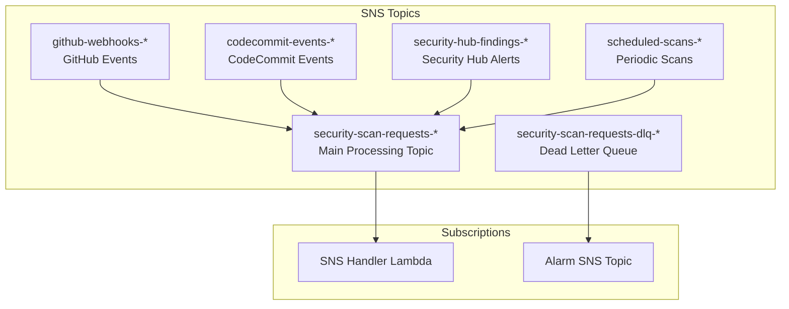
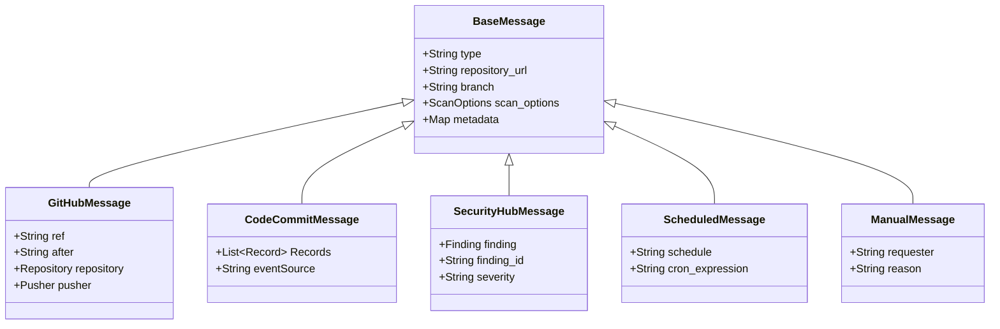
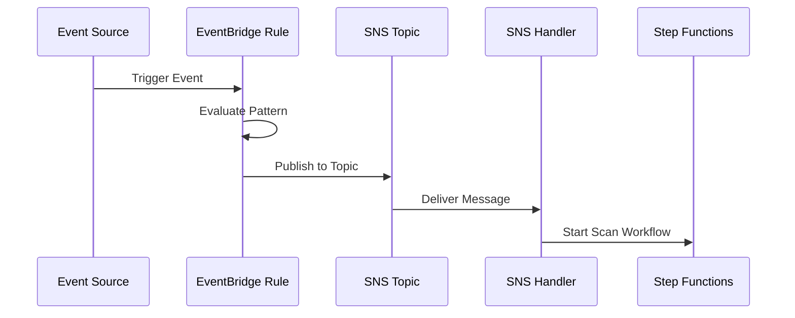
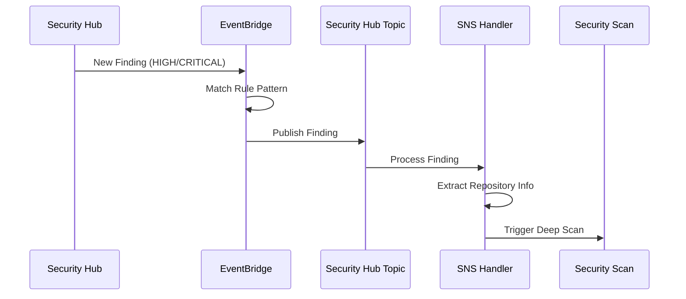
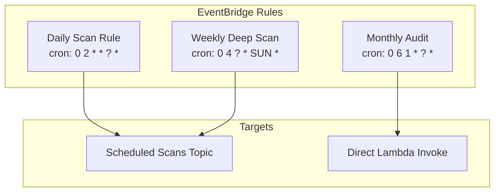
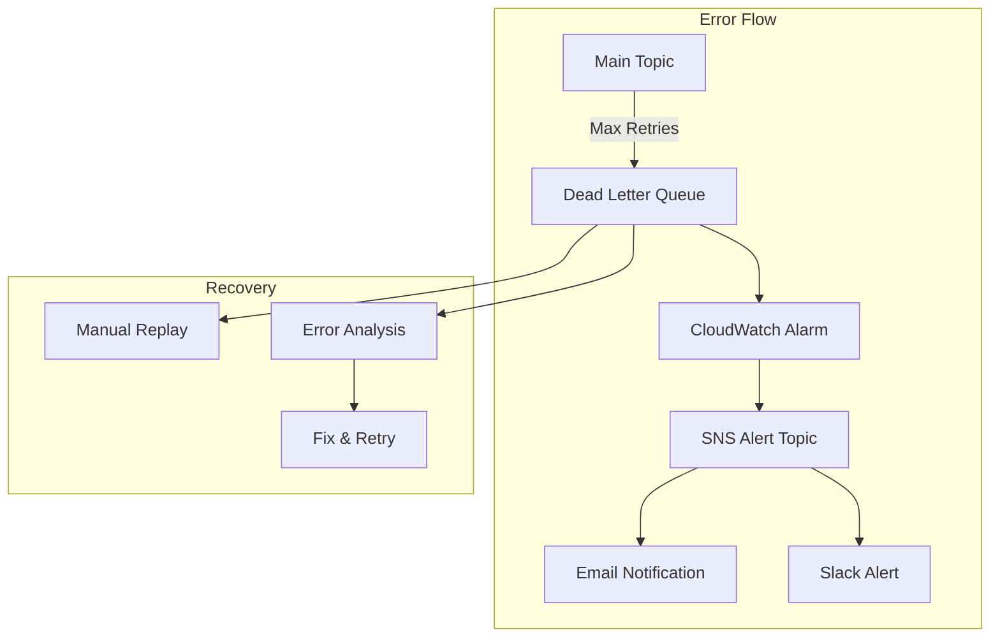

# SNS Integration Guide

## Overview

This guide provides comprehensive instructions for integrating various event sources with the Security Audit Framework through AWS SNS (Simple Notification Service).

## Table of Contents
1. [SNS Topic Architecture](#sns-topic-architecture)
2. [Message Formats](#message-formats)
3. [Integration Patterns](#integration-patterns)
4. [GitHub Integration](#github-integration)
5. [AWS CodeCommit Integration](#aws-codecommit-integration)
6. [Security Hub Integration](#security-hub-integration)
7. [EventBridge Integration](#eventbridge-integration)
8. [Custom Integrations](#custom-integrations)
9. [Message Attributes](#message-attributes)
10. [Error Handling](#error-handling)

## SNS Topic Architecture



## Message Formats

### Base Message Structure

All messages should follow this base structure:

```json
{
  "type": "message_type",
  "repository_url": "https://github.com/org/repo.git",
  "branch": "main",
  "scan_options": {
    "deep_scan": true,
    "cost_limit": 50.0,
    "specific_agents": ["SAST", "SECRETS"],
    "skip_agents": ["IaC"],
    "priority": "high"
  },
  "metadata": {
    "custom_field": "value"
  }
}
```

### Message Type Reference



## Integration Patterns

### Pattern 1: Direct Publishing

```bash
# Simple repository URL
aws sns publish \
  --topic-arn arn:aws:sns:us-east-1:123456789012:security-scan-requests-prod \
  --message "https://github.com/myorg/myrepo.git" \
  --message-attributes '{"scan_enabled":{"DataType":"String","StringValue":"true"}}'

# JSON message with options
aws sns publish \
  --topic-arn arn:aws:sns:us-east-1:123456789012:security-scan-requests-prod \
  --message file://scan-request.json \
  --message-attributes file://attributes.json
```

### Pattern 2: Event-Driven Publishing



## GitHub Integration

### Setting Up GitHub Webhooks

1. **Create Webhook Endpoint**
   ```bash
   # Get the GitHub topic ARN
   GITHUB_TOPIC=$(aws cloudformation describe-stacks \
     --stack-name SecurityAudit-prod-SNS \
     --query "Stacks[0].Outputs[?OutputKey=='GitHubWebhookTopicArn'].OutputValue" \
     --output text)
   
   # Create SNS HTTPS endpoint
   echo "Webhook URL: https://sns.us-east-1.amazonaws.com/?Action=Publish&TopicArn=$GITHUB_TOPIC"
   ```

2. **Configure in GitHub**
   - Go to Settings → Webhooks in your repository
   - Add webhook with the SNS HTTPS endpoint
   - Select events: Push, Pull Request
   - Content type: application/json

3. **Message Processing Flow**
   ```mermaid
   graph LR
       GH[GitHub] -->|Webhook| SNS[GitHub Topic]
       SNS -->|Forward| Main[Main Topic]
       Main -->|Filter| Handler[SNS Handler]
       Handler -->|Parse| Scan[Start Scan]
   ```

### GitHub Webhook Payload Example

```json
{
  "ref": "refs/heads/main",
  "after": "abc123def456",
  "repository": {
    "clone_url": "https://github.com/example/webapp.git",
    "name": "webapp",
    "owner": {
      "login": "example"
    },
    "private": false,
    "language": "Python"
  },
  "pusher": {
    "name": "developer",
    "email": "dev@example.com"
  }
}
```

## AWS CodeCommit Integration

### Setting Up CodeCommit Triggers

```bash
# Create trigger for all events
aws codecommit put-repository-triggers \
  --repository-name MyRepository \
  --triggers '[{
    "name": "SecurityScan",
    "destinationArn": "arn:aws:sns:us-east-1:123456789012:codecommit-events-prod",
    "branches": ["main", "develop"],
    "events": ["all"]
  }]'

# Create trigger for specific events
aws codecommit put-repository-triggers \
  --repository-name MyRepository \
  --triggers '[{
    "name": "SecurityScanOnPush",
    "destinationArn": "arn:aws:sns:us-east-1:123456789012:codecommit-events-prod",
    "branches": ["main"],
    "events": ["updateReference"]
  }]'
```

### CodeCommit Event Structure

```json
{
  "Records": [{
    "eventSourceARN": "arn:aws:codecommit:us-east-1:123456789012:MyRepository",
    "eventTime": "2023-01-01T00:00:00.000Z",
    "eventSource": "aws:codecommit",
    "awsRegion": "us-east-1",
    "codecommit": {
      "references": [{
        "ref": "refs/heads/main",
        "commit": "abc123def456"
      }]
    }
  }]
}
```

## Security Hub Integration

### Automatic Finding Processing



### EventBridge Rule for Security Hub

```json
{
  "source": ["aws.securityhub"],
  "detail-type": ["Security Hub Findings - Imported"],
  "detail": {
    "findings": {
      "Severity": {
        "Label": ["CRITICAL", "HIGH"]
      },
      "RecordState": ["ACTIVE"],
      "WorkflowStatus": ["NEW"]
    }
  }
}
```

### Security Hub Finding Handler

```python
def process_security_hub_finding(finding):
    # Extract repository information from resources
    for resource in finding.get('Resources', []):
        if 'codecommit' in resource.get('Type', ''):
            return {
                'repository_url': f"codecommit::{resource['Id'].split('/')[-1]}",
                'scan_options': {
                    'deep_scan': True,
                    'priority': 'critical'
                }
            }
```

## EventBridge Integration

### Scheduled Scans



### Creating Scheduled Scan Rules

```bash
# Create daily scan rule
aws events put-rule \
  --name DailySecurityScan \
  --schedule-expression "cron(0 2 * * ? *)" \
  --description "Daily security scan for critical repositories"

# Add SNS target
aws events put-targets \
  --rule DailySecurityScan \
  --targets "Id"="1","Arn"="arn:aws:sns:us-east-1:123456789012:scheduled-scans-prod","Input"='{
    "type": "scheduled_scan",
    "repository_url": "https://github.com/myorg/critical-app.git",
    "branch": "main",
    "schedule": "daily",
    "scan_options": {
      "deep_scan": false,
      "cost_limit": 25.0
    }
  }'
```

## Custom Integrations

### Jenkins Integration

```groovy
// Jenkinsfile snippet
pipeline {
    stages {
        stage('Security Scan') {
            steps {
                script {
                    def scanRequest = [
                        type: 'custom_integration',
                        repository_url: "${env.GIT_URL}",
                        branch: "${env.GIT_BRANCH}",
                        integration_name: 'Jenkins',
                        custom_data: [
                            build_id: "${env.BUILD_ID}",
                            job_name: "${env.JOB_NAME}",
                            commit_sha: "${env.GIT_COMMIT}"
                        ]
                    ]
                    
                    sh """
                        aws sns publish \
                          --topic-arn ${env.SECURITY_SCAN_TOPIC} \
                          --message '${groovy.json.JsonOutput.toJson(scanRequest)}' \
                          --message-attributes '{"scan_enabled":{"DataType":"String","StringValue":"true"}}'
                    """
                }
            }
        }
    }
}
```

### GitLab CI Integration

```yaml
# .gitlab-ci.yml
security-scan:
  stage: test
  script:
    - |
      cat > scan-request.json << EOF
      {
        "type": "custom_integration",
        "repository_url": "$CI_PROJECT_URL.git",
        "branch": "$CI_COMMIT_REF_NAME",
        "integration_name": "GitLab CI",
        "custom_data": {
          "pipeline_id": "$CI_PIPELINE_ID",
          "commit_sha": "$CI_COMMIT_SHA",
          "triggered_by": "$GITLAB_USER_LOGIN"
        }
      }
      EOF
    - |
      aws sns publish \
        --topic-arn $SECURITY_SCAN_TOPIC \
        --message file://scan-request.json \
        --message-attributes '{"scan_enabled":{"DataType":"String","StringValue":"true"}}'
```

### Terraform Cloud Integration

```hcl
# Terraform webhook configuration
resource "aws_sns_topic_subscription" "terraform_cloud" {
  topic_arn = aws_sns_topic.scan_requests.arn
  protocol  = "https"
  endpoint  = "https://app.terraform.io/webhooks/sns"
  
  filter_policy = jsonencode({
    source = ["terraform-cloud"]
  })
}
```

## Message Attributes

### Supported Attributes

| Attribute | Type | Description | Example |
|-----------|------|-------------|---------|
| scan_enabled | String | Enable/disable scanning | "true" |
| Priority | String | Scan priority level | "high", "normal", "low" |
| DeepScan | String | Enable deep scanning | "true", "false" |
| CostLimit | Number | Maximum scan cost | "50.0" |
| Agents | String | Comma-separated agent list | "SAST,SECRETS,API" |
| SkipAgents | String | Agents to skip | "IaC,CONTAINER" |
| NotificationEmail | String | Email for notifications | "team@example.com" |
| Tags | String | Comma-separated tags | "production,critical" |

### Using Message Attributes

```python
# Python example
import boto3
import json

sns = boto3.client('sns')

message_attributes = {
    'scan_enabled': {
        'DataType': 'String',
        'StringValue': 'true'
    },
    'Priority': {
        'DataType': 'String',
        'StringValue': 'high'
    },
    'CostLimit': {
        'DataType': 'Number',
        'StringValue': '100.0'
    },
    'Agents': {
        'DataType': 'String',
        'StringValue': 'SAST,SECRETS,API_SECURITY'
    }
}

response = sns.publish(
    TopicArn='arn:aws:sns:us-east-1:123456789012:security-scan-requests-prod',
    Message=json.dumps({
        'repository_url': 'https://github.com/myorg/myapp.git',
        'branch': 'main'
    }),
    MessageAttributes=message_attributes
)
```

## Error Handling

### Dead Letter Queue Processing



### Common Error Scenarios

1. **Invalid Message Format**
   ```json
   {
     "error": "Invalid message format",
     "expected": "JSON object with 'repository_url' field",
     "received": "plain string",
     "action": "Message sent to DLQ"
   }
   ```

2. **Repository Access Denied**
   ```json
   {
     "error": "Repository access denied",
     "repository": "https://github.com/private/repo.git",
     "action": "Check credentials in Secrets Manager"
   }
   ```

3. **Cost Limit Exceeded**
   ```json
   {
     "error": "Cost limit exceeded",
     "requested_limit": 50.0,
     "estimated_cost": 75.0,
     "action": "Scan aborted, notification sent"
   }
   ```

### Monitoring SNS Performance

```sql
-- CloudWatch Insights query for SNS processing
fields @timestamp, @message
| filter @message like /SNS Handler/
| stats count() by bin(5m) as time_window
| sort time_window desc
```

### Troubleshooting Checklist

- [ ] Verify SNS topic exists and is accessible
- [ ] Check IAM permissions for publishing
- [ ] Validate message format (JSON)
- [ ] Ensure message attributes are properly formatted
- [ ] Check subscription filters
- [ ] Monitor CloudWatch Logs for handler errors
- [ ] Verify Lambda function is subscribed to topic
- [ ] Check DLQ for failed messages
- [ ] Review CloudWatch metrics for throttling

## Best Practices

1. **Always include message attributes** for filtering and routing
2. **Use appropriate message types** for different sources
3. **Set reasonable cost limits** to prevent runaway scans
4. **Monitor DLQ regularly** for failed messages
5. **Use structured logging** in custom integrations
6. **Implement retry logic** with exponential backoff
7. **Tag messages appropriately** for tracking and billing
8. **Use specific agent lists** when possible to optimize costs
9. **Enable CloudWatch Logs** for all integrations
10. **Test integrations** in non-production environment first

## Conclusion

The SNS integration provides a flexible, scalable way to trigger security scans from various sources. By following these patterns and best practices, you can seamlessly integrate the Security Audit Framework into your development workflow.